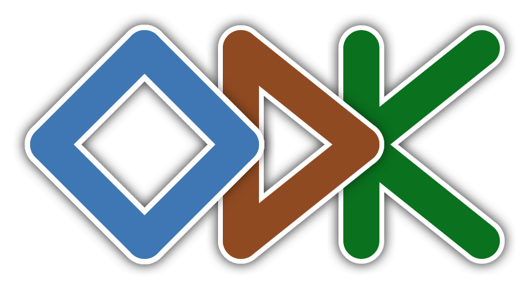
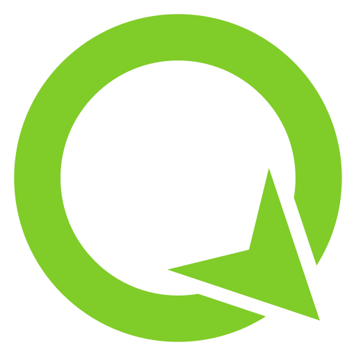

```{r}
#| label: setup
#| include: false

# The comparison matrix is read from one CSV so that the two head-to-head
# slides can never drift apart, and so that correcting a price is a one-line
# edit to a data file rather than a hunt through prose. Base R only: the deck
# then renders on any machine with Quarto and knitr, with nothing to install.
cmp <- utils::read.csv(
  "data/comparison.csv",
  stringsAsFactors = FALSE,
  encoding = "UTF-8"
)

# Every row carries the date its source page was checked. They are all checked
# in one pass, so a single date is expected; if a later edit re-checks only
# some rows, this shows the oldest one rather than silently picking one.
#
# The month name is taken from `month.name` rather than from `format(…, "%B")`,
# which reads the machine's LC_TIME: rendered on the author's laptop that
# yields "21 září 2026" on an English slide.
checked_date <- min(as.Date(cmp$checked_on))
checked_on <- paste(
  as.integer(format(checked_date, "%d")),
  month.name[as.integer(format(checked_date, "%m"))],
  format(checked_date, "%Y")
)

# Returns the table as a string for `cat()` in an `output: asis` chunk rather
# than letting knitr print it, so the HTML reaches the slide as raw markup with
# no cell-output wrapper around it.
#
# The chunks below are labelled `matrix-…`, NOT `tbl-…`. A `tbl-` prefix is
# Quarto's cross-reference convention: it makes the cell a numbered table and
# prints "Table 1" above it, which on a slide whose own title says what the
# table is reads as a stray artefact and pushes the table down by the height of
# the caption block.
matrix_table <- function(columns, headers) {
  out <- cmp[, columns, drop = FALSE]
  names(out) <- headers
  as.character(
    knitr::kable(out, format = "html", escape = FALSE, row.names = FALSE)
  )
}
```

## What this session covers

- **The lifecycle** – where a record goes between a wet notebook and a GBIF
  download, and which stage each tool actually serves.
- **The options** – form-based apps, GIS-native field mapping, observation
  platforms, and the specialised tools for patrols and camera traps.
- **The comparison** – eight tools against ten criteria, every price and
  licence checked this month.
- **The trade-offs** – what the paid products genuinely do better, and what
  "free" costs you instead.
- **The decision** – a flowchart, and the field pitfalls that cost a season.

::: {.smaller}
Written from the position of an agency standing up its own collection system,
not from a vendor's. Every tool here gets a strength and a limitation, and the
open ones are not assumed to win.
:::

::: notes
Set expectations: this is not a tutorial in any one app. By the end they should
be able to shortlist two or three tools for a named survey and know what
question decides between them. Mention that the comparison table and its
sources ship as a CSV in the repository, so they can re-check prices
themselves rather than trusting a slide from September.
:::

## Why this matters {.aopk-section}

A record that arrives wrong is not cheaper to fix in the office. In practice it
is not fixed at all – it is quietly dropped, or worse, used.

::: notes
The framing for the whole session. Data quality is won or lost at the point of
capture, because that is the only moment when the person who can still check
the fact is standing in front of it.
:::

## Paper to digital, and what it actually fixes

::: {.aopk-cols}
::: {}
**What going digital fixes**

- The **second transcription disappears**. Paper to spreadsheet is where most
  errors enter and none are caught.
- **Position is measured, not described.** "300 m NE of the bridge" cannot be
  reprojected, buffered or joined.
- **Validation moves to the moment of capture** – the one moment the observer
  can still walk back and look.
- **Metadata is written while it is true**: observer, method, effort, accuracy.
:::

::: {}
**What it does not fix**

- A **weak protocol collected faster** is still a weak protocol, now with more
  rows.
- **Taxonomy** still needs a backbone and a reviewer.
- **Absence and effort** are recorded only if the form insists on them.
- A phone in a wet pocket at minus five degrees is **less reliable than a
  pencil**. Plan for both.
:::
:::

::: notes
The honest version: digitising is a multiplier, not a fix. If the protocol does
not say what counts as a survey, no app will. The pencil point is not a joke –
every one of these systems should have a paper fallback form that matches the
digital one field for field.
:::

## The lifecycle a record travels

- **Plan** – the protocol, the target features, who collects, what counts as
  effort. Decided before the form is built.
- **Collect** – the form or the map on the device, offline.
- **Validate** – constraints at capture, review afterwards, taxon matching.
- **Store** – one authoritative copy, versioned and backed up.
- **Analyse** – scripted and re-runnable, not a spreadsheet lineage.
- **Publish and archive** – Darwin Core to GBIF, a DOI that still resolves in
  ten years.

::: {.smaller}
FAIR – findable, accessible, interoperable, reusable – is the test at the end
[@fair]. The practical form of it: could a colleague re-run this in five years
without telephoning you?
:::

::: notes
Insist that the stages are ordered and that most failures are one stage earlier
than where they are noticed. A taxon that will not match at publication is
usually a free-text species field at collection. Ask the room which of these
seven stages is currently the weakest in their own institution.
:::

## The landscape, mapped onto the lifecycle {.no-leaf}

```{mermaid}
flowchart LR
  subgraph FIELD["In the field"]
    direction LR
    P["<b>Plan</b><br>XLSForm<br>QGIS project"] --> C["<b>Collect</b><br>Kobo · ODK · Epicollect5<br>QField · Mergin · SMART<br>iNaturalist"] --> V["<b>Validate</b><br>form constraints<br>GPS accuracy limits"]
  end
  subgraph OFFICE["In the office"]
    direction LR
    S["<b>Store</b><br>PostGIS · GeoPackage<br>Git for forms and code"] --> A["<b>Analyse</b><br>QGIS · R<br>sf · terra"] --> B["<b>Publish</b><br>Darwin Core<br>GBIF via IPT"] --> Z["<b>Archive</b><br>Zenodo DOI"]
  end
  V --> S
```

::: notes
The point of the picture is that no tool covers the whole row. Anything sold as
end-to-end is either doing one stage well and the rest badly, or locking you
in. Note that Git sits under Store because a form definition is source code.
:::

## Collecting in the field {.aopk-section}

Four families of tool, and the choice between them is made by the geometry and
the crew, not by the price list.

## Form-based collection: the open options {.no-leaf}

::: {.aopk-cols}
::: {}
{.logo} · AGPL-3.0

- **EU server in Ireland**, a global server, or self-hosted.
- Free for non-profits: **5 000 submissions a month, 1 GB**.
- Limitation: **not open to government bodies**; paid from $25 a month.

{.logo-icon} **ODK Collect + Central** · Apache-2.0

- The project Kobo forks. **Self-hosted it costs only the server and the
  admin.**
- Limitation: **ODK Cloud from $199 a month**, so self-host Central.
:::

::: {}
{.logo} · MIT server

- Free with **no stated limits**, run by the Centre for Genomic Pathogen
  Surveillance at Oxford. Nothing to set up.
- Limitation: **points only**, no lines or polygons, and the API is read-only.
  Offered "as-is" by a small research team.

**All three share**

- **XLSForm or a web builder**, offline Android collection, and a defined
  export.
- Geometry is stored in **WGS84 only**. Reprojection is your job, downstream.
:::
:::

::: notes
The Kobo eligibility point matters for this room specifically: a ministry or an
environmental protection agency is not a non-profit for Kobo's purposes, so the
free tier is not the plan to build a national system on. That is an argument
for self-hosted ODK Central rather than against Kobo – the form definitions are
portable between them because both speak XLSForm.
:::

## What a form enforces at the point of capture {.no-leaf}

An XLSForm survey sheet is a spreadsheet. These four rows are most of what
separates a clean dataset from a dirty one.

| type | name | label | constraint / relevant |
|---|---|---|---|
| `geopoint` | `pond_loc` | Pond centre | `selected-at(${pond_loc}, 3) < 15` |
| `select_one taxon` | `species` | Species observed | from a controlled list |
| `integer` | `count` | Individuals counted | `. >= 0 and . <= 5000` |
| `begin_repeat` | `obs` | One per species | relevant: `${survey_done} = 'yes'` |

::: {.smaller}
The first constraint refuses a fix worse than 15 m accuracy. The third catches
a typed extra zero. The fourth is how one visit yields several occurrence rows
instead of one wide row you have to unpick later [@xlsform; @odk_question_types].
:::

::: notes
This is the slide to slow down on. The accuracy constraint is the single
highest-value line in any biodiversity form: it turns GPS accuracy from
something you hope about into something the device refuses to skip. Note that
the same sheet runs on Kobo, ODK and Survey123 – the form is the portable
asset, not the platform.

It also answers the ministry's question on data quality at the source. A record
fixed to 15 m, dated, with a named observer, is good enough to help draw a
Natura 2000 boundary from the moment it is captured; the evidence tiers are on
the project site.
:::

## Form-based collection: the paid comparators

::: {.aopk-cols}
::: {}
{.logo-icon} **ArcGIS Survey123** · proprietary

- **XLSForm plus Esri extensions**, so a form is portable in, though not
  cleanly out.
- Publishes straight into the organisation's existing feature services and
  dashboards.
- Limitation: **no list price is published**; it comes bundled into ArcGIS user
  types and consumes credits for storage and reports.
:::

::: {}
{.logo} · proprietary

- **$43–55 per user per month**, minimum five users, billed annually.
- Polished builder, strong offline behaviour, device management, real support.
- Limitation: **proprietary end to end**, and the hosting location is not
  published – awkward if data residency is a legal requirement.
:::
:::

::: {.smaller}
Both are worth their money in the right organisation. Neither is worth it to
stand up one survey of twelve people.
:::

::: notes
Be fair here. Survey123 is genuinely the right answer for an organisation that
already pays for ArcGIS Enterprise – the marginal cost is zero and the
integration is free. The trap is buying the whole platform in order to get the
form app.
:::

## GIS-native field mapping

::: {.aopk-cols}
::: {}
{.logo-icon} **QField + QFieldCloud** · GPL-2.0+ / MIT

- Your **QGIS project itself** goes to the device: layers, styling, snapping,
  attribute forms, offline basemaps.
- Cloud is **free up to 100 MB**, then €18 per user per month; private
  instances on request, hosted in Switzerland.
- Limitation: **it presumes QGIS skills.** Someone must own the project file.
:::

::: {}
{.logo} · AGPL-3.0 / GPL-2.0

- Same idea, with **versioned sync** as the centrepiece and a Community Edition
  you can host yourself at no licence cost.
- Cloud from **€15.80 per contributor per month**; data residency only on the
  Enterprise plan.
- Limitation: same QGIS dependency, and the free cloud tiers are narrow –
  500 MB for small non-profits.
:::
:::

::: notes
The decisive difference from the form apps: these carry any CRS QGIS supports,
so a surveyor can work in KOSOVAREF01 and the data lands in it. Kobo and ODK
give you WGS84 and nothing else.
:::

## When the map is the working document {.no-leaf}

::: {.aopk-cols}
::: {}
**Use GIS-native when**

- The feature is a **polygon or a line** – a habitat patch, a transect, a
  management compartment.
- The surveyor must **see existing features** and edit them, not just add new
  points.
- **Topology matters**: adjoining patches, no gaps, no overlaps.
- The work happens in a **national CRS** and must stay there.
:::

::: {}
**Use a form when**

- Records are **independent point observations**.
- The crew is **large, changing, or minimally trained**.
- The survey is **short-lived** and must be running next week.

{.logo-icon} **ArcGIS Field Maps** is the paid
equivalent: excellent offline map areas and device management, no XLSForm, and
the same absence of a published list price.
:::
:::

::: notes
The heuristic to leave them with: if you would draw it, use QField or Mergin;
if you would fill it in, use a form. Mixed surveys usually want both, and that
is fine – the join happens in the database, not in the app.
:::

## Observation platforms and citizen science

- **iNaturalist** – identification support, a large community, research-grade
  records flow weekly to GBIF. Limitation: you are a guest on someone else's
  platform and you do not set the licence.
- **Observation.org** – strong in Europe, validation by regional experts, a
  species-rich app. Limitation: national portals vary in how they moderate.
- **eBird** – the deepest structured effort data in existence, for birds only.
- **National recording systems** – the record stays in national custody, which
  is usually the point.

::: {.smaller}
These are a **complement to institutional monitoring, not a substitute**.
Volunteer effort is uneven in space and time; a designed survey is not.
:::

::: notes
Give the volume figures from the next slide's speaker notes if asked. The
important governance point: a citizen-science platform is a data source you can
use and an outreach channel you can run, but it is not where a competent
authority should hold its own evidence base.
:::

## Who owns the record, and what the licence decides

| Platform | Licence on GBIF | Records in GBIF |
|---|---|---|
| iNaturalist research-grade | CC BY-NC 4.0 | 166.9 million |
| Observation.org | CC BY-NC 4.0 | 135.1 million |
| eBird (EOD) | CC BY 4.0 | 1 775.8 million |

- **GBIF accepts only CC0, CC BY and CC BY-NC.** Anything else never leaves the
  platform.
- **NC is not free.** It bars uses a consultant or a developer may need, and
  the boundary is untested.
- The **contributor**, not the institution, chooses the licence on these
  platforms.

::: notes
Counts read from the GBIF API on 21 September 2026; they move constantly. The
practical consequence for a ministry: if you need evidence that can be reused
without a licence argument in an environmental impact assessment, you cannot
rely on a CC BY-NC citizen-science feed. You need your own CC BY or CC0 data.
:::

## Specialised tools, one slide

- **SMART** – patrol and law-enforcement monitoring for protected areas. Free
  and open, maintained by an eight-organisation partnership. Limitation: it is
  a management system, not a biodiversity database.
- **CyberTracker** – icon-driven, works for non-literate observers. Free for
  Indigenous, citizen-science and student projects; otherwise ZAR 350–3 400 a
  year by data volume.
- **Camera traps and acoustics** – **Agouti** (Wageningen and INBO, data stays
  yours) and **Wildlife Insights** (free for many users, but **government
  bodies are expected to pay** unless in a transitioning economy).
- **Camtrap DP** is the TDWG standard both export to, and GBIF ingests via the
  IPT [@camtrapdp].

::: notes
The rule worth stating: pick the platform that exports the standard. Agouti and
Wildlife Insights disagree about a lot, but both emit Camtrap DP, so the
decision is reversible. A camera-trap platform with only a proprietary export
is a one-way door.
:::

## From the device to the database {.aopk-section}

The gap where most systems leak: the manual CSV export, emailed, renamed and
edited by hand.

## Pull the data, do not export it {.no-leaf}

::: {.aopk-cols}
::: {}
**Why the manual export fails**

- It is **undated, unversioned and unattributable** the moment it is downloaded.
- Someone always **opens it in Excel**, and the dates and leading zeros change.
- Corrections made on the server **never reach the copy** already in circulation.
- It cannot be **re-run**, so the analysis is not reproducible.
:::

::: {}
**The scripted alternative**

```r
library(robotoolbox)
kobo_setup(
  url   = "https://eu.kobotoolbox.org",
  token = Sys.getenv("KOBO_TOKEN")
)
ponds <- kobo_asset("aBcD...") |>
  kobo_submissions()
```

One function, the live server, a token from an environment variable and never
from the script. `ruODK` does the same for ODK Central; both QGIS-based tools
hand you a GeoPackage that `sf::st_read()` opens directly.
:::
:::

::: notes
This is the hinge of the whole talk for anyone who already collects digitally.
The message is not "use R" – it is "the pipeline must start at the server, not
at a file someone downloaded". Mention that the same principle is what the
15:15 session builds the automated reports on.
:::

## Version the form, not only the data

- A **form definition is source code.** Changing a question mid-season changes
  the meaning of a column, and without a history nobody can say when.
- Keep in Git: the **XLSForm or QGIS project**, the **processing scripts**, the
  **codebooks**, and the **documentation**.
- Tag a release when the season opens. Then **v1 data and v2 data are
  distinguishable** rather than merged in silence.
- GitHub Pages publishes the documentation from the same repository, so the
  method people read is the method that ran.

::: {.smaller}
Not the raw data itself: that belongs in a database with proper access control.
Git holds what defines and transforms it.
:::

::: notes
The mid-season form change is the failure everyone in the room has lived
through. If they take one thing from this slide: put the form file under
version control on day one, before the first submission.
:::

## Publishing and archiving

- **Darwin Core** is the shared vocabulary. Map your fields to it once, at the
  design stage, not after collection.
- **GBIF IPT** publishes the dataset and makes it citable; the record keeps
  your institution as publisher.
- **Zenodo** gives a DOI to the snapshot the analysis actually used, which is
  what a paper or a report must cite.
- **Metadata is written at collection time.** Retrospective metadata is
  reconstruction, and it shows.

::: {.smaller}
Covered properly in yesterday's GBIF session and in this morning's national
portal and geoportal sessions – this slide is only the handover.
:::

::: notes
Deliberately short. Do not re-teach GBIF publishing here; Karel and Martin have
covered the portal and INSPIRE sides. The one original point is the last
bullet: metadata at capture.
:::

## A worked pilot: BiodivPond {.aopk-section}

Biodiversity monitoring of ponds – a Biodiversa+ pilot running 2026 to 2028,
testing whether novel methods survive contact with real field crews.

## BiodivPond: the pipeline {.no-leaf}

```{mermaid}
flowchart LR
  subgraph F["Field"]
    direction LR
    K["KoboCollect<br>offline, Android"] --> E["Kobo EU server<br>eu.kobotoolbox.org"]
  end
  subgraph R["One R script"]
    direction LR
    P["robotoolbox<br>kobo_submissions()"] --> T["tidy to one row<br>per occurrence"] --> M["match names to the<br>GBIF backbone"]
  end
  subgraph O["Outputs"]
    direction LR
    G["GBIF<br>Darwin Core"]
    Z["Zenodo<br>DOI"]
    W["Project site<br>GitHub Pages"]
  end
  E --> P
  M --> G
  M --> Z
  M --> W
```

::: notes
Standardised sampling of a minimum of six ponds per partner, sixty in total, in
spring 2026, plus a citizen-science component targeting five hundred more
ponds across European biogeographical regions. Taxa: amphibians, fish, aquatic
macro-invertebrates and bats, by traditional methods, eDNA and passive acoustic
monitoring. Those figures are from the public project site; do not quote
partner numbers you have not checked.
:::

## BiodivPond: what worked, what hurt

::: {.aopk-cols}
::: {}
**What the design got right**

- **The EU server was chosen before the first form**, not argued about
  afterwards.
- **One row per species occurrence** from the start, so nothing had to be
  unpivoted later.
- **Names matched to the GBIF backbone inside the pipeline**, so a failure is
  visible on every run rather than at publication.
<!-- TODO: author to add – one concrete thing that worked, with the evidence -->
:::

::: {}
**What was painful**

<!-- TODO: author to add – multi-country form versioning -->
<!-- TODO: author to add – what the citizen-science arm cost in moderation -->
<!-- TODO: author to add – eDNA and PAM outputs vs. an occurrence-shaped form -->

::: {.smaller}
Three slots left deliberately empty. They are the part of the case study the
audience will remember, and they have to be true.
:::
:::
:::

::: notes
Fill these in before delivery. The lessons-learned half is the reason to show a
case study at all; a pipeline diagram alone is a brochure.
:::

## Choosing {.aopk-section}

Eight tools, ten criteria. Prices, licences and hosting checked on one day and
already ageing.

## Head to head: cost, effort and control {.no-leaf}

::: {.matrix}
```{r}
#| label: matrix-cost
#| echo: false
#| output: asis
cat(matrix_table(
  c("tool", "cost", "licence", "hosting", "curve", "lockin"),
  c("Tool", "Cost model", "Licence", "Hosting and sovereignty",
    "Learning curve", "Lock-in")
))
```
:::

::: {.note}
As checked on `r checked_on`. Source URLs per row are in
`data/comparison.csv`; re-check before you quote any of it.
:::

::: notes
Do not read the table out. Point at three cells: Kobo's non-profit-only free
tier, Esri's absent list price, and the fact that four of the eight rows can be
self-hosted. Everything else they can read in the handout.
:::

## Head to head: fieldwork and integration {.no-leaf}

::: {.matrix}
```{r}
#| label: matrix-field
#| echo: false
#| output: asis
cat(matrix_table(
  c("tool", "offline", "geometry", "crs", "logic", "api"),
  c("Tool", "Offline", "Geometry", "CRS", "Form logic", "API and R")
))
```
:::

::: {.note}
As checked on `r checked_on`. The `crs` column is the one that decides more
projects than the price column does.
:::

::: notes
The CRS column is the slide's argument. Every form-based tool stores WGS84 and
only WGS84; the two QGIS-based tools carry whatever the project carries. If the
deliverable is a cadastre-grade polygon in KOSOVAREF01, that single column has
already made the choice.
:::

## What the paid tools actually buy you

- **Support with a deadline attached.** An open-source forum answers when
  someone feels like it. A contract answers on Tuesday.
- **Device management** – enrolling, wiping and updating fifty tablets without
  touching them.
- **A polished builder** that a non-technical colleague can use unaided.
- **Enterprise integration** – single sign-on, existing feature services,
  dashboards your director already reads.
- **Someone to blame.** In a public body that is a real procurement argument,
  not a joke.

::: notes
Say this without irony. The room contains people who will have to justify a
choice to an auditor, and "it was free" is a weak answer when a season is lost.
:::

## The hidden costs of free

- **Self-hosting is a post, not a download.** ODK Central needs a server,
  backups, TLS certificates and somebody who notices when it stops.
- **Donor-funded servers change terms.** Kobo's free tier was re-cut in 2023
  and is closed to government bodies now.
- **Training is the largest line either way**, and it does not shrink because
  the licence is zero.
- **"As-is" means as-is.** Epicollect5 is run by a small research team, and
  says so plainly.
- **Migration you postpone is migration you pay for**, with interest.

::: {.smaller}
Open source removes the licence fee and the lock-in. It does not remove the
staff cost, and pretending otherwise is how these projects fail in year two.
:::

::: notes
The balance to the previous slide. The honest summary of both: open source
shifts cost from procurement to staffing. If you have no staff capacity and a
budget, buy. If you have capacity and no budget, build. If you have neither,
start with a hosted free tier and plan the exit.
:::

## A decision guide {.no-leaf .diagram-tall}

```{mermaid}
flowchart LR
  Q1{"Lines or polygons,<br>captured offline?"}
  Q1 -->|Yes| QF["<b>QField</b> or <b>Mergin Maps</b><br>your QGIS project, any CRS"]
  Q1 -->|No| Q2{"Must the data stay<br>on an EU server?"}
  Q2 -->|Yes| KO["<b>Kobo EU server</b>, or<br><b>self-hosted ODK Central</b>"]
  Q2 -->|No| Q3{"Already running<br>ArcGIS Enterprise?"}
  Q3 -->|Yes| ES["<b>Survey123</b> or <b>Field Maps</b><br>no new procurement"]
  Q3 -->|No| EP["<b>Epicollect5</b> for speed<br><b>Kobo global</b> for form logic"]
```

::: notes
Stress that the first question is geometry, not money, because geometry is the
one requirement no amount of budget works around. The EU-server question is
second because for a public authority it is usually a legal constraint rather
than a preference.
:::

## Field pitfalls that cost a season {.no-leaf}

::: {.aopk-cols}
::: {}
- **Record GPS accuracy as a field**, and refuse fixes worse than your
  threshold. A point without an accuracy value cannot be assessed later.
- **Fix the CRS before the first survey.** Kosovo's national system is
  KOSOVAREF01 / Balkans zone 7, **EPSG:9141**; devices give you WGS84
  (EPSG:4326). Decide where the conversion happens, once.
- **Generalise sensitive species before publication**, not before storage. Keep
  the precise record internally.
:::

::: {}
- **Charge, spare and test the devices.** Cold kills batteries faster than the
  survey does.
- **Freeze the form when the season opens.** If it must change, version it and
  record which version produced which row.
- **Back up off the device daily**, and test a restore before you need one.
- **Write metadata at capture.** Anything written in November is memory, not
  metadata.
:::
:::

::: notes
The EPSG number is worth writing on a whiteboard: 9141 for projected work,
4326 out of the device, and the transformation is EPSG:9144. The sensitive
species point often gets reversed in practice – people blur at collection and
then cannot do the analysis.
:::

## Where to start on Monday

- **Pick one survey**, not a system. Build its form, run it with four people
  for a week, and count what broke.
- **Take a starter XLSForm** with geopoint, an accuracy constraint, a
  controlled taxon list and a repeat group. Both Kobo and ODK will load it.
- **Or take a starter QGIS project for Annex I habitat mapping** – segment
  layer, habitat code list, share and condition fields, one offline orthophoto –
  and open it in QField.
- **Put both under version control the same day.**
- **Decide the publication licence before collection**, because it constrains
  the consent text you need.

::: {.smaller}
All of it, including this deck and the comparison data:
`github.com/jonasgaigr/kosovo-biodiversity-data-workshop-2026`
:::

::: notes
End on the smallest possible next step. A week-long pilot with four people
answers more questions than a six-month evaluation, and it is reversible.
:::

## Sources {.no-leaf}

::: {#refs}
:::

::: {.note}
The full source list, with an access date for every figure in this deck, is
`references.bib`; the per-row sources behind the comparison are the `source`
and `checked_on` columns of `data/comparison.csv`. Product names and logos are
the trademarks of their respective owners, used here to identify the products
compared; no affiliation or endorsement is implied. ODK is free and
open-source software — `getodk.org`.
:::

## {.aopk-closing}

::: {.aopk-mission}

**THANK YOU FOR YOUR ATTENTION!**

github.com/jonasgaigr/kosovo-biodiversity-data-workshop-2026

:::

::: {.aopk-lockup}

:::

::: {.aopk-web}
aopk.gov.cz
:::
