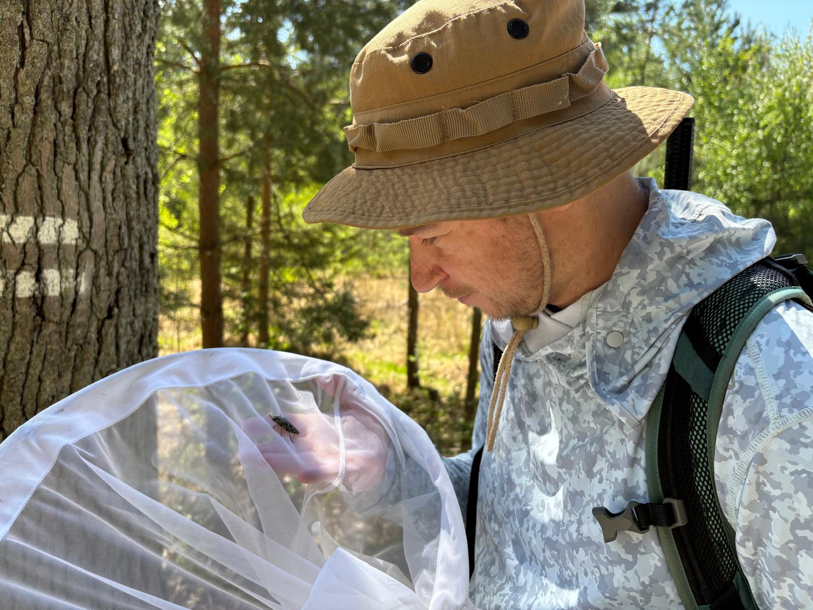

## About me {.no-leaf}

::: {.aopk-cols .speaker}
::: {.speaker-photo}
{fig-alt="Jonáš Gaigr in the field, looking at an insect in a sweep net."}
:::

::: {}
- **Nature Conservation Agency of the Czech Republic** (AOPK ČR) – since 2020
- **Biodiversa+** – lead development and coordination of the **BiodivPond**
  pond-monitoring pilot
- **TAIEX** – expert mission to Kosovo, December 2023
- **ConNatur LIFE** – with Ukrainian partners, the path to Natura 2000 and to
  implementing the Birds and Habitats Directives in Ukraine
:::
:::

::: notes
First, briefly, who I am. Since 2020 I have worked at the Nature Conservation
Agency of the Czech Republic, the government body for nature conservation.

In Biodiversa+, the European biodiversity partnership, I led the development of
BiodivPond, a pilot on monitoring the biodiversity of ponds, and I now coordinate
it. You will hear more about it on Wednesday.

This is not my first time in Kosovo. I was here in December 2023 on a TAIEX
expert mission. And in the ConNatur LIFE project I work with Ukrainian partners
on the path for Ukraine to Natura 2000 and to the two directives, Birds and
Habitats.

In all of this, the question is the same: how data get from the field to a
decision. That is today's topic.
:::

## A national database in five layers {.no-leaf}

::: {.layers}
::: {.lyr-ref}
**Reference layer** – every other layer points here

- national **checklist**, with **crosswalks** to the EU and GBIF taxonomic backbones
- **protection and Red List status**, by taxon ID
- **grids** and **protected sites**
- **habitat crosswalk** and **vocabularies**
:::

::: {.lyr}
**1 · Staging** – raw data exactly as received. Never edited.
:::

::: {.lyr}
**2 · Validation** – automatic checks and expert review. A status on every record.
:::

::: {.lyr}
**3 · Core** – verified, interpreted records. The one copy everybody uses.
:::

::: {.lyr .lyr-out}
**4 · Publication** – portal with sensitive species generalised · API · GBIF via the IPT · reporting
:::
:::

::: notes
As we saw in the previous talk, a national system holds many kinds of data. Here
is how I recommend organising them: in layers.

On the left is the reference layer, and everything else points to it. The most
important table in the whole database is the national taxonomic checklist. Every
record points to a taxon ID, never to a name typed by hand. Each taxon also
carries its ID in the EU taxonomic backbone, PESI, and in GBIF's, now the
Catalogue of Life. Names change on all sides; these crosswalks keep your records
usable for EU reporting and GBIF for decades. Hang protection status
and Red List category on the same taxon ID. When a name changes, or a species
goes on the Red List, you change one row, not a million records. The same layer
holds the grids, the protected-site boundaries, the crosswalk from national
habitat types to Annex I habitats, and the lists of allowed values.

Then the data travel down. Staging keeps the raw data exactly as they arrived.
Validation gives every record a status. Core holds the verified records, the one
copy everybody uses. Publication produces everything the outside world sees.

Why layers? Because you can always go back. If an interpretation was wrong, you
run it again from the raw data, and nothing is lost.

For a newer system, the reference layer and staging can start as a few
well-kept tables. The layers are a way of working before they are software.
:::

## Three sources, one path {.no-leaf .diagram-tall}

```{mermaid}
%%| file: data-flow.mmd
```

::: {.figcaption}
The layers are the same for every source. What differs is how much checking a record needs – and who does it.
:::

::: notes
This is the whole talk on one picture. On the left are three kinds of source.
A is structured monitoring, collected by trained people on a fixed protocol. B is
records from experts we trust, specialists who send many records every year. C
is citizen science, which we bring in when we need it.

All three follow the same path: staging, validation, core, publication. What
differs is how much checking a record needs, and who does it. A monitoring record
has already been checked by the form and by the coordinator. A citizen-science
record needs an expert before it goes into an official product. A trusted
expert's record sits in between: checked by the machine, and by a person only
when the machine raises a flag.

Under everything is the reference layer. Every automatic check in validation is a
check against the checklist, the grids and the vocabularies.

Now look at the dashed line going backwards, from reporting to validation. When
somebody uses the data, for a report, a Red List or an impact assessment, they
find problems. Those problems go back to validation, and the record is corrected
in core. That loop is the most important arrow on this slide, and I will come
back to it in a few minutes.
:::

## Flow A – structured monitoring {.no-leaf}

::: {.aopk-cols}
::: {}
- **Checks built into the form:** required fields, pick-lists fed from the
  checklist and vocabularies, device position with its accuracy
- **Automatic sync** to staging – nobody retypes
- **The coordinator validates:** protocol followed, all visits done, values
  plausible
- **Stored as an event:** one visit, with its occurrences and measurements
:::

::: {}
::: {.col-head}
One visit, stored as an event
:::

::: {.evt}
[Event]{.evt-tag} **Visit** · pond 07 · 14 May · night torch count · 2 observers, 2 h

::: {.evt-kids}
[Occurrence]{.evt-tag .occ} *Bombina variegata* – present, 12 adults

[Occurrence]{.evt-tag .occ} crested newt (*Triturus* sp.) – [absent]{.absent}

[Measurement]{.evt-tag .mof} water depth – 0.6 m

[Measurement]{.evt-tag .mof} shading – 30 %
:::
:::

::: {.figcaption}
Illustrative values. The event carries the date, site, method and effort; the
absence is only meaningful because of them.
:::
:::
:::

::: notes
Flow A is structured monitoring. In Czechia, surveyors fill in Survey123 forms,
and Karel showed you one. The first line of quality is the form itself. Required
fields cannot be skipped. The species list and every pick-list come from the
reference layer, so nobody can type a name the checklist does not know. The
position comes from the device, with its accuracy in metres. A newer system does
not need Survey123: the free form tools we compare on Wednesday do the same job.

When the form is sent, it syncs into staging automatically. Nobody retypes
anything, and a whole class of errors disappears.

Then a person checks it: the scheme coordinator or an expert. Was the protocol
followed? Were all the planned visits done? Are the numbers plausible? In our
system the coordinator marks the data as guaranteed, and only then do they flow
into the species database.

On the right is the structure. The visit is stored as an event, with its date,
site, method and effort, and the occurrences and measurements hang from it. Why?
Because only an event can hold an absence. Without it, you cannot tell not found
from not looked for. Absences and effort are what make a trend.
:::

## Flow B – records from trusted experts {.no-leaf}

::: {.aopk-cols}
::: {}
- **Trusted status is earned:** accreditation per species group, reviewed
- **Automatic overnight import** from their app or database
- **Automatic checks:** name matches the checklist · point inside the country,
  plausible uncertainty · plausible date and season · far outside the known
  range?
- **Clean → accepted. Flagged → review queue**, not rejected
:::

::: {}
::: {.col-head}
A status on every record: the NDOP example
:::

::: {.codes}
| | Validation – proposed by a regional expert |
|---|---|
| 0 | not yet validated |
| 1 | proposed as fully reliable |
| 3 | proposed as less reliable |
| 6 | proposed as erroneous |
| 9 | proposed for correction |
:::

::: {.figcaption}
A central guarantor then confirms the proposal. For species protected by Czech
law, species of Community interest and Annex I birds, this check is compulsory.
:::
:::
:::

::: notes
Flow B is for experts we already trust: the specialists who send hundreds of
records a year. Checking each of those records by hand wastes the validators'
time, so the trust is given once, to the person.

Trusted status is granted by accreditation, per species group. A botanist trusted
for orchids is not automatically trusted for beetles. And the status is reviewed.

Their records come in automatically, as a batch import every night. The Czech
BioLog app works like this: selected users have their records transferred
automatically, while other users' records are checked, usually against a photo.

Every record then passes automatic checks. Does the name match the checklist? Is
the point inside the country, with a plausible uncertainty? Is the date plausible?
A butterfly flying in January is suspicious. Is it far outside the known range?

A clean record is accepted. A flagged record is not deleted. It goes to a review
queue, because the unusual record is sometimes the most valuable one: a new site,
a range expansion. The queue needs an owner and a deadline, or it becomes a
second bin.

On the right is how NDOP stores the result: a validation status on every record,
proposed by a regional expert and confirmed by a central guarantor.
:::

## Flow C – citizen science, on demand {.no-leaf}

::: {.aopk-cols}
::: {.smaller}
- **Imported when needed** – for one assessment, taxon or area
- **Filters first:** open licence · community identification grade · photo
- **Expert validation** before use in any official product
- **Source always visible:** `datasetName`, `basisOfRecord`,
  `identificationVerificationStatus`
- **Deduplicate** – one sighting often arrives by two routes
:::

::: {}
::: {.col-head}
What stays on the record after import
:::

::: {.dwc}
| Term | Value |
|---|---|
| datasetName | iNaturalist Research-grade Observations |
| basisOfRecord | HumanObservation |
| identificationVerificationStatus | community consensus – expert check pending |
| license | CC BY-NC 4.0 |
| associatedMedia | link to the photograph |
| occurrenceID | the platform's own ID, kept unchanged |
:::

::: {.figcaption}
Illustrative. `identificationVerificationStatus` takes free text in Darwin Core,
so agree a short national list of values for it.
:::
:::
:::

::: notes
Flow C is citizen science. The volume is large and growing, and so is the range of
quality. My advice: do not pour it into the core continuously. Import it on
demand, when you need it for a specific assessment, taxon or area. NDOP, for
example, takes in research-grade observations from iNaturalist. Observation.org
and national apps are the other usual sources.

Filter first. Is the licence open enough for your use? Has the community agreed
on the identification? iNaturalist calls that research grade. Is there a photo an
expert can check?

Then an expert validates, before the records go into anything official. A
research-grade identification is a good start, not a guarantee.

Two rules make this safe. First, the source must always stay visible. Three
Darwin Core fields do it: datasetName says where the record came from,
basisOfRecord says what kind of record it is, and identificationVerificationStatus
says who has checked the identification. Second, deduplicate. The same observer
often uploads the same sighting to two platforms, and one frog must not be counted
twice.

For a small team this flow is the cheapest place to start. The platforms have
already done the collecting.
:::

## Data that nobody uses do not get corrected {.no-leaf}

::: {.aopk-pair}
::: {}
::: {.col-head}
Build the way back in
:::

- **Any user can flag** a record
- **The validator** for that group reviews it
- **The observer is told** – and often knows the answer
- **Every change is versioned:** who, when, why – an audit trail
:::

::: {}
::: {.col-head}
The uses that find the errors
:::

- **Art. 17 / Art. 12 reporting** – with EU accession
- **Natura 2000 / Emerald** site assessments
- **Red List** – AOO and EOO from the records (R package *ndopred*)
- **EIA and permitting**
- **Protected-area management plans**
:::
:::

::: {.loop}
[Use]{.step .use} [→]{.arr} [Flag]{.step} [→]{.arr} [Review]{.step} [→]{.arr} [Tell the observer]{.step} [→]{.arr} [Correct, with a trace]{.step} [↺]{.arr}
:::

::: notes
This is the key message of my talk. Data that nobody uses, and nobody relies on,
do not get corrected. Errors are not found by checking a database harder. They
are found by using it.

So build the way back into the system. Any user can flag a record: this looks
wrong. The flag goes to the validator for that species group. The observer is
told, because the observer often knows the answer, and because people who never
hear back stop sending records. And every change is versioned: who changed what,
when, and why.

On the right are the uses that do this checking for you. Reporting under Article
17 of the Habitats Directive and Article 12 of the Birds Directive means a
distribution map on the ten-kilometre grid for every listed species, every six
years. For Kosovo this is an obligation that comes with EU accession.

Natura 2000 and Emerald site assessments: a record that puts a site on the list
will be questioned.

Red List assessments compute area of occupancy and extent of occurrence straight
from the records. In Czechia we use an R package, ndopred. IUCN guidance says not
to trim outlying points from the extent, so one wrong point far away inflates the
range, and the assessor goes and checks it. And ndopred leaves out records that
validators have marked as doubtful, so the status does real work.

In impact assessment and permitting, a record can stop a project, so both sides
check it. The same happens in management planning.

Every use is also a quality check. Plan for it.
:::

## Speak Darwin Core from day one {.no-leaf}

::: {.aopk-cols}
::: {.smaller}
- **Use DwC directly – or keep a documented crosswalk** from every internal field
- **Occurrence** and **Event** cores; **Extended Measurement or Fact**;
  **Humboldt** for effort and completeness
- **Fixed values:** `basisOfRecord`; `occurrenceStatus` = present / absent
- **Mandatory:** `coordinateUncertaintyInMeters`; persistent `occurrenceID` and
  `eventID`
- **Pays back:** GBIF without rework · EU reporting and INSPIRE · open tools ·
  no vendor lock-in · cross-border exchange
:::

::: {}
::: {.col-head}
A crosswalk: survey spreadsheet → Darwin Core
:::

::: {.xwalk}
| Your column | Darwin Core term |
|---|---|
| Species | scientificName + taxonID |
| Date | eventDate (2026-06-18) |
| Lat / Long | decimalLatitude / decimalLongitude |
| GPS accuracy (m) | coordinateUncertaintyInMeters |
| Found? yes / no | occurrenceStatus: present / absent |
| Record no. | occurrenceID – never reused |
:::

::: {.figcaption}
The full crosswalk, with the event and measurement fields, is on the handout.
:::
:::
:::

::: notes
Now the standard that makes all of this work. Karel showed you the basic Darwin
Core fields. My message is stronger: build in Darwin Core from day one.

You have two options. Use Darwin Core terms directly as your field names. Or keep
your own field names, in your own language, but keep a documented crosswalk that
says which Darwin Core term every field maps to. On the right is part of one, for
a typical survey spreadsheet. The full version is on your handout.

Darwin Core gives you the structure I have described. The Occurrence core for
single records, the Event core for monitoring visits. Measurements go into the
Extended Measurement or Fact extension, which comes from OBIS, the ocean data
network, and is accepted by GBIF. For effort and completeness, what was searched
for and how hard, there is the Humboldt extension, ratified in 2024. It is new,
and tool support is still growing.

Some values come from fixed lists: basisOfRecord, and occurrenceStatus, present
or absent. Two things I would make mandatory. Coordinate uncertainty in metres,
because a point without it cannot be used safely. And a persistent ID on every
record and every event, never changed and never reused. That ID is how a
correction finds its record.

What does it buy you? Publishing to GBIF without rework. An easier path to EU
reporting and INSPIRE. For example, Article 17 maps are drawn on the European
ten-kilometre grid: a record with coordinates and an uncertainty can be placed
in its grid cell automatically, and a record without them cannot. Then the open
tools built for Darwin Core. No lock-in to one vendor. And exchange with your
neighbours, who use the same terms.
:::

## GIS structure – one geometry, many records {.no-leaf}

::: {.aopk-cols}
::: {.smaller}
::: {.col-head}
Oracle Spatial (SDO) × ArcGIS geodatabase (SDE)
:::

- **Geometry stored as `SDO_GEOMETRY`** – ArcGIS, QGIS, GDAL and plain SQL
  all read it. Esri's default, `ST_Geometry`, needs Esri's libraries for SQL
- **Tables registered with the geodatabase** – ArcGIS edits the table SQL
  reads; no copies to keep in sync
- **One geometry type per table** – points, lines, polygons apart; ArcGIS
  takes no mix
- **Same coordinate system, tolerance and spatial index** on both sides
- **Versioned edits are invisible to SQL** until posted – version only what
  must be
:::

::: {}
::: {.col-head}
1 geometry : N records
:::

::: {.evt}
[Geometry]{.evt-tag} **G-1042** · polygon · pond 07 with its shore

::: {.evt-kids}
[Occurrence]{.evt-tag .occ} *Bombina variegata* – 14 May 2026

[Occurrence]{.evt-tag .occ} *Bombina variegata* – 3 June 2027
:::
:::

::: {.evt}
[Geometry]{.evt-tag} **H-0215** · polygon · meadow segment

::: {.evt-kids}
[Habitat]{.evt-tag .occ} 6510 lowland hay meadows – 70 %

[Habitat]{.evt-tag .occ} 6430 tall-herb fringes – 30 %
:::
:::

::: {.figcaption}
Illustrative. A record holds its geometry's ID, never a shape of its own:
drawn once, corrected once, and every record on it follows.
:::
:::
:::

::: notes
Species records and habitat maps are spatial, so the database needs a GIS
structure, and the first rule is on the right: one geometry, many records. The
shape is stored once, in a geometry table. A record holds only the ID of its
geometry, never a shape of its own. The pond is drawn once, and every visit to
it, year after year, points to it. A habitat-mapping polygon works the same way:
one segment, often a mosaic of several habitat types, each with its share. When a
boundary is corrected, it is corrected once, and every record on it follows.

On the left is a common set-up for a national database: Oracle underneath,
ArcGIS on top. Oracle's own geometry type is SDO_GEOMETRY. Esri's enterprise
geodatabase, still often called SDE, uses its own type by default, ST_Geometry,
and SQL can read that only through Esri's libraries. So store the geometry as
SDO_GEOMETRY and register the tables with the geodatabase. Then ArcGIS edits the
same table that SQL, QGIS and the web portal read, and nobody keeps copies in
sync.

Three rules keep the two sides compatible. One geometry type per table, because
ArcGIS does not take a mix. The same coordinate system, tolerance and spatial
index on both sides. And versioned edits in ArcGIS stay invisible to SQL until
they are posted. If you build on PostgreSQL instead, the choice is PostGIS
against ST_Geometry, and the answer is the same.
:::

## Six habits of a database that lasts {.no-leaf}

::: {.habits}
::: {}
[1]{.num}
**A named data steward** – and validators for each species group

Here: [to be named]{.placeholder}
:::

::: {}
[2]{.num}
**Funded surveys deliver DwC-ready data** – written into every contract
:::

::: {}
[3]{.num}
**Raw data never overwritten** – provenance on every record
:::

::: {}
[4]{.num}
**A written sensitive-species policy** – generalise, do not hide
:::

::: {}
[5]{.num}
**Clear licence and citation** – so contributors get credit
:::

::: {}
[6]{.num}
**Start simple, then iterate** – one flow, one group, one year
:::
:::

::: notes
How do you run a database like this? Six habits, taken from the longer list on
your handout.

One: a named data steward. A person, not a committee. And a network of
validators, at least one for each species group. In Czechia, regional experts
validate and a central guarantor confirms. The principle travels; the size does
not.

Two: every survey paid for with public money delivers its data in a form that
maps to Darwin Core, as a condition of the contract. The report is not the
deliverable. The data are.

Three: raw data are never overwritten, and every record carries its provenance:
where it came from, when, and what was changed.

Four: a written sensitive-species policy. The usual answer is to generalise the
location in public, not to hide the record. I will show the Czech solution this
afternoon.

Five: clear licensing and citation. People share data when they know how it will
be used, and that their name stays on it.

Six: start simple and iterate. A newer system can start with a checklist, one
validated flow, and a first dataset on GBIF. Add the next flow when the first
one runs.
:::

## Four things to take away {.no-leaf}

::: {.takeaways}
[1]{.num}**Layers protect you** – keep the raw data, validate, then publish.

[2]{.num}**Every record carries a status and a source.**

[3]{.num}**Use is the best quality control** – build the way back in.

[4]{.num}**Darwin Core from day one** – every field mapped.
:::

::: {.discuss}
**For discussion – in Kosovo\*:** which flow comes first?
[answer from the room]{.placeholder} · Who owns the national checklist?
[to be agreed]{.placeholder} · Who validates each species group?
[to be agreed]{.placeholder}
:::

::: {.note}
\*This designation is without prejudice to positions on status, and is in line
with UNSCR 1244/1999 and the ICJ Opinion on the Kosovo declaration of
independence.
:::

::: notes
Four things to remember. Layers protect you: keep the raw data, validate, and
only then publish. Every record carries a status and a source, which is what lets
you trust it and trace it. Use is the best quality control, so build the way back
in from the start. And speak Darwin Core from day one, with every field mapped.

To open the discussion, three questions for you. Which of the three flows matters
most here today? Who should own the national checklist? And who could validate
each species group? Karel and I would like to hear how you see it.

This afternoon I will show what such a system makes possible: analysis, open
access that still protects sensitive species, and faster permits.
:::

## {.aopk-closing}

::: {.aopk-mission}

**THANK YOU FOR YOUR ATTENTION!**

github.com/jonasgaigr/kosovo-biodiversity-data-workshop-2026

:::

::: {.aopk-lockup}

:::

::: {.aopk-web}
aopk.gov.cz
:::
