## What this covers

- **The question** – is this species, in this site, in the condition the site
  was designated to keep it in?
- **The data** – what a habitat map and a species record have to carry before
  either can answer it.
- **The assessment** – what "good" means for a habitat and for a species, and
  where the threshold it is measured against comes from.
- **The checks** – on the indicator before it is used, and on the result before
  it is published.
- **The machinery** – the whole evaluation as a public repository anyone can
  read and re-run.

::: {.smaller}
Worked through on the Czech implementation, so every screenshot and every chart
here is a real output rather than a mock-up. That is also why the labels are
Czech; each caption carries the translation. The principles are not Czech.
:::

## Why condition is assessed site by site {.aopk-section}

::: {.aopk-section-photo}

:::

Article 17 reporting says how a feature is doing in the country. It does not
tell the person responsible for one site what to do on Monday.

## Adaptive management, and what it asks of data

::: {.aopk-cols}
::: {}
**The cycle**

1. **Monitor** – collect to a written method, so this year compares with the
   last.
2. **Evaluate** – set the result against the condition the site is meant to
   deliver.
3. **Plan and prioritise** – decide where intervention is worth its cost.
4. **Implement** – carry out the management.
5. **Repeat** – and find out whether it worked.
:::

::: {}
**What it needs**

- A **target state** that was written down before the result came in.
- An assessment that is **repeatable** – the same data yield the same verdict
  next year and in the next region.
- A result at the **scale of the decision**: the site, and inside it the
  subsite that is actually managed.
- **Uncertainty carried through**, not silently resolved – "unknown" is an
  answer, and it commissions monitoring.
:::
:::

## Target features, sites, subsites

::: {.aopk-cols}
::: {}
**The features**

- **61 natural habitat types** of Annex I of the Habitats Directive
- **68 animal** and **41 plant species** of Annex II
- **65 bird species** of Annex I of the Birds Directive

Protection is built out of the combination – habitats, flagship, keystone and
umbrella species.

What is evaluated is a target feature **in a site** – not a species in a
country, and not a site as a whole.
:::

::: {}
**The levels**

- A **record** is evaluated where the method allows it.
- Records aggregate to a **subsite** – the pond, the meadow, the cave.
- Subsites aggregate to the **site** (SCI/SAC or SPA): this is the level the
  result is published at.
- Sites aggregate upward to the **region** and to the **country**.

The chain runs one way. Nothing is assessed at the site that was not assessed
below it.
:::
:::

## The chain, drawn {.no-leaf}

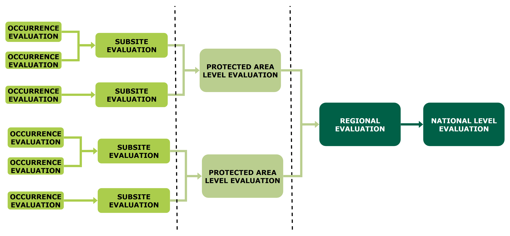

::: {.figcaption}
Left to right: the assessment of one occurrence; of the subsite it belongs to;
of the protected area the result is published at (SCI/SAC or SPA); then the
region and the country. Every arrow is a written aggregation rule, not a
judgement made afresh at each level. That is what lets a regional total be
assembled from sites assessed by different people. Drawn from the framework's
own diagram, `BiodivMonCZ/host_naturecz`.
:::

## Four states, one scale

::: {.state-scale}
::: {.state-unknown}
[Unknown]{.state-name}

Insufficient data to decide.

⇒ monitoring required
:::

::: {.state-good}
[Good]{.state-name}

Habitat: sufficient **area and** quality. Species: stable or increasing
population **and** sufficient habitat.

⇒ continued occurrence secured
:::

::: {.state-deteriorated}
[Deteriorated]{.state-name}

Habitat: insufficient area **or** quality. Species: population holding, but
habitat insufficient.

⇒ future occurrence probably threatened
:::

::: {.state-bad}
[Bad]{.state-name}

Habitat: insufficient area **and** quality. Species: absent, or population
declining.

⇒ future occurrence clearly threatened
:::
:::

::: {.smaller}
Four classes, carried unchanged through every level of aggregation and every
taxonomic group. A scale that is redefined per group cannot be summed across
groups.
:::

## The evidence base {.aopk-section}

::: {.aopk-section-photo}
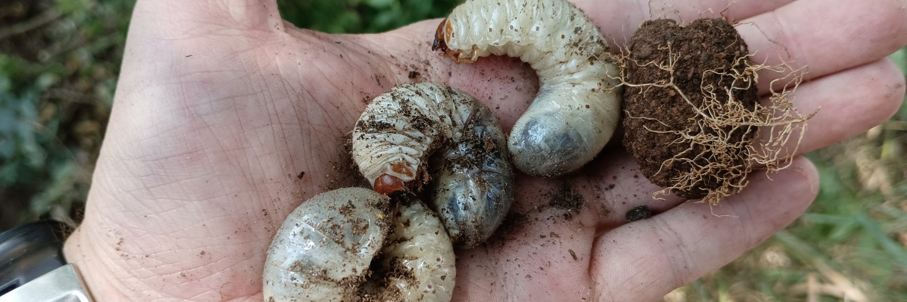
:::

Two national holdings, one rule: if the method is not written down, the
comparison is not available.

## Habitats: the mapping layer {.no-leaf}

::: {.aopk-cols}
::: {}
Exact polygons with thin attributes cannot be evaluated at all. The whole
country was mapped in **2002–2007** and has been updated since, in roughly
**3,500 districts** on a **12-year cycle**.

**What each segment has to carry**

- **Who** mapped it and **when**. Currency belongs to the segment, not to the
  layer.
- **How much** of it the habitat occupies, as a share *and* an area, so a
  mixed segment can still be summed.
- The **quality** score, derived from the field attributes by a published rule.
:::

::: {}
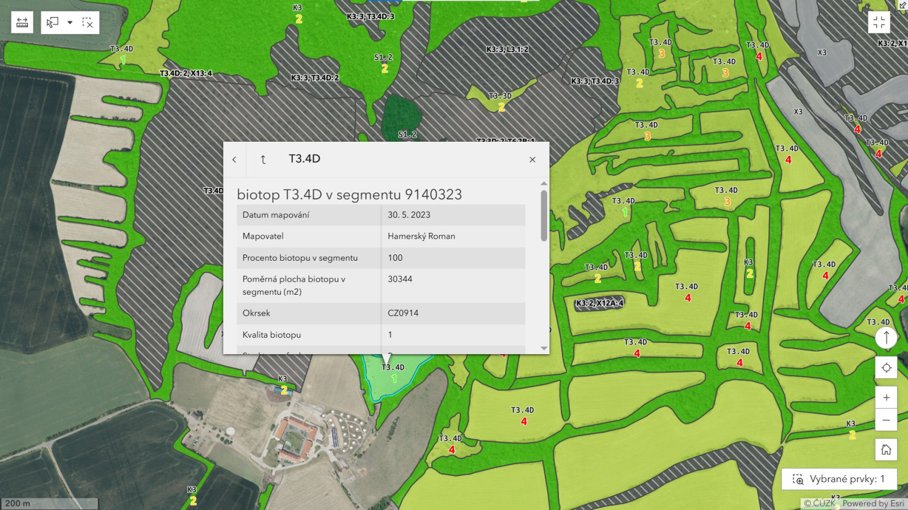

::: {.figcaption}
One segment selected. *Datum mapování* date, *Mapovatel* surveyor, *Procento
biotopu v segmentu* share of the segment, *Poměrná plocha* the resulting area
in m², *Okrsek* mapping district, *Kvalita biotopu* quality.
:::
:::
:::

## Two pictures of one hillside {.no-leaf}

::: {.aopk-pair}
::: {}
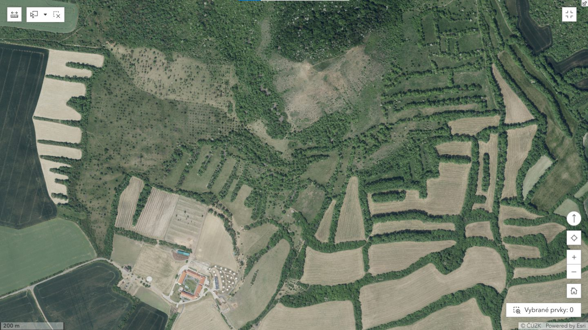

::: {.figcaption}
The orthophoto. Every boundary a reader draws on it is their own, and no two
readers draw the same one.
:::
:::

::: {}
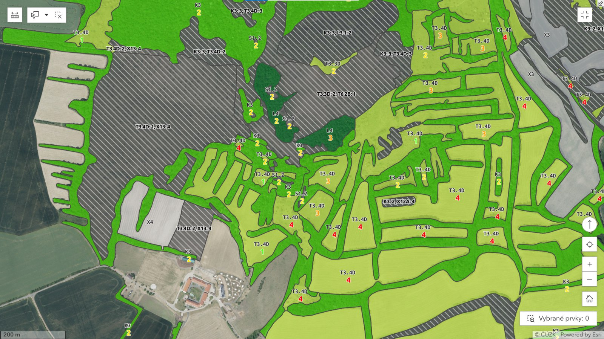

::: {.figcaption}
The mapping layer over the same extent. `T3.4D: 2` – dry grassland at quality
2; hatched grey `X` segments are non-natural. A segment may hold **more than
one habitat**, each with its own share and its own quality.
:::
:::
:::

## A first habitat map: the minimum standard {.no-leaf}

::: {.aopk-cols}
::: {}
**Map**

- **1:10,000** on the orthophoto, in the field. Minimum unit **about 0.25 ha**
  for extensive types; smaller for rare or high-value stands.
- **Small and linear habitats** – springs, fens, caves – as points or lines,
  with the **true area or width** recorded.
- **Mosaics** allowed: several habitats per segment, each with its **share**
  and its own **condition**.
- **Condition as attributes**, scored by a **lookup**, not judged site by site.
:::

::: {}
**Check**

- **Re-survey a random 5–10 %** of segments independently; report agreement on
  the code and on the condition.
- **Points and centroids** say where to map first. They cannot be summed into
  an area, and Annex III asks for one.
- **Typical species from GBIF**: where to look first, for types with
  conspicuous indicators. Never an area, a condition or an SDF value.
:::
:::

::: {.smaller}
Czech practice for comparison: 0.15–0.25 ha for extensive types; points and
lines below about 2,500 m² or 50 m width (Lustyk & Guth 2011, AOPK ČR).
:::

## Species: what a record has to carry {.no-leaf}

::: {.aopk-cols}
::: {}
- **Which survey it came from.** Only records collected under the relevant
  methodology set the verdict.
- A **stable identifier**, so a correction can be traced.
- **Absence as data**: `NEG` marks a visit that found nothing – without it a
  dataset shows arrival and never decline.
- A **date range**, an **observer** and a **survey event**, so effort can be
  reconstructed.
- A **location at two resolutions** (geometry and grid cell), a
  **reliability** flag, and **structured observations** rather than prose.
:::

::: {}
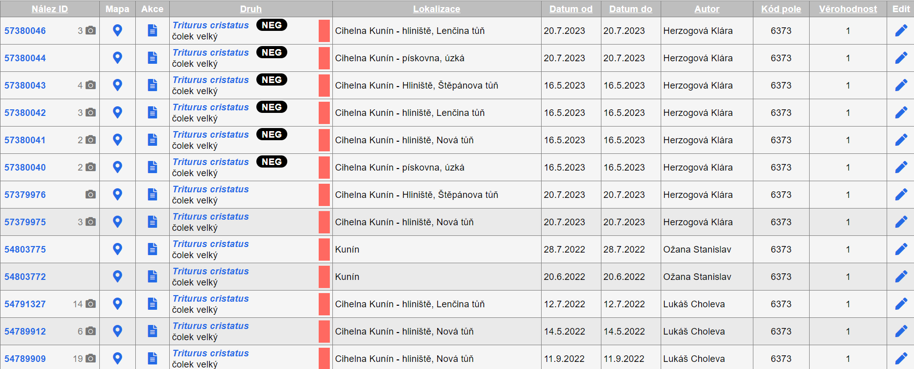

::: {.figcaption}
Records in the **Species Occurrence Database (NDOP)**. *Nález ID* record id,
*Druh* species with the `NEG` badge, *Lokalizace*, *Datum od / do*, *Autor*,
*Kód pole* grid cell, *Věrohodnost* reliability. The camera icons count the
photographs attached to each record.
:::
:::
:::

## How a site is assessed {.aopk-section}

::: {.aopk-section-photo}

:::

Current state against target state. The difficulty is almost entirely in the
second term.

## Habitats: area, quality, and the table that fixes it {.no-leaf}

::: {.aopk-cols}
::: {}
**Area** comes from the update mapping, and **degraded segments and clearings
count toward it** – raising area and lowering quality rather than erasing the
habitat from the ledger.

**Quality** is derived from the update attributes: **RB** representativeness,
**DG** degradation, **SF** structure and function, **RH** regional context.

It is a **lookup**, not a judgement made site by site: the same attributes
yield the same value everywhere, every year. The table translates **both
vocabularies**, and an unanticipated combination is **added to it**.
:::

::: {}
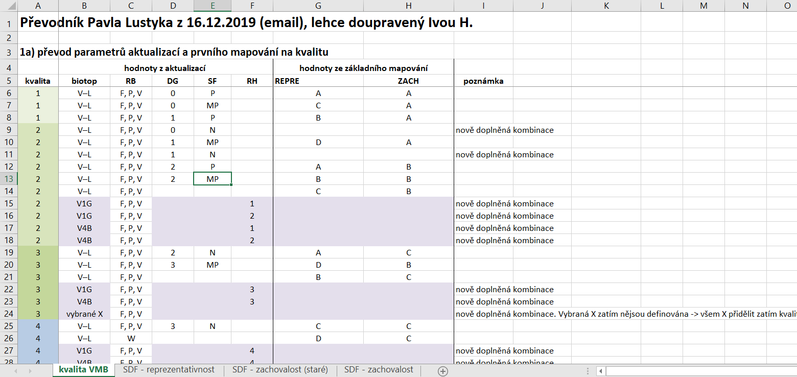

::: {.figcaption}
*kvalita* 1–4, 1 best, against *hodnoty z aktualizací* the update parameters
RB, DG, SF, RH and *hodnoty ze základního mapování* the baseline REPRE and
ZACH. *nově doplněná kombinace* – "newly added combination". The header line
says who produced the table and who last adjusted it.
:::
:::
:::

## Setting the target state for a habitat {.no-leaf}

::: {.aopk-cols}
::: {}
The target draws on what was **reported to the Commission** in the Standard
Data Form. For **area**, it is one of three:

- the **baseline** mapping value (VMB1),
- the **update** value (VMB2),
- or the **minimum viable area**.

The choice between the first two turns on **why** the figure changed: a
methodological change is not a loss.

**Quality**: the minimum target is **2**. No target may sit below the condition
at designation, and every one is reviewed regionally.
:::

::: {}
::: {.worked}
**Example 1 – methodological change**

Baseline 2004: **300 ha** of beech forest. Update: **230 ha**. Minimum viable
area: 30 ha.

Regional office judged the drop **methodological**.

→ **Target = 230 ha**
:::

::: {.worked}
**Example 2 – real change**

Baseline 2004: **27 ha**. Update: **18 ha**. Minimum viable area: **30 ha**.

Regional office judged the drop **real**.

→ **Target = 30 ha**
:::
:::
:::

## Species: population first, environment as diagnosis {.no-leaf}

::: {.aopk-cols}
::: {}
- The **key indicators are population indicators** – presence, abundance,
  reproduction, trend.
- **Environmental indicators do not set the verdict.** They say *why* a
  population indicator came out poorly: habitat loss, fish pressure,
  water-level manipulation, drying out, encroachment.

The population target is reconciled from **targeted monitoring**, the
**Standard Data Form**, the **maximum abundance** in NDOP and **expert
knowledge of the site**. Where these disagree, the disagreement is the
substance of the discussion.
:::

::: {}
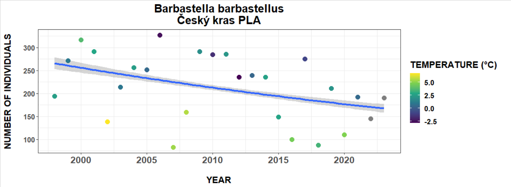

::: {.figcaption}
Population trend for *Barbastella barbastellus* in one site, with mean annual
temperature carried on the points. The declining count is the finding; the
covariate is where the explanation starts, not where the verdict is made.
:::
:::
:::

## From many indicators to two

::: {.aopk-cols}
::: {}
The pilot evaluations ran **seven or more indicators at site level**. They were
defensible one at a time and nearly unreadable together, and a single weak
indicator could carry a whole site.

The revised rule uses **two**:

- the **percentage of subsites** assessed as being in good condition,
- the **number of individuals**, as a rolling mean over the last three
  monitored years, against the target.
:::

::: {}
| Subsites in good condition | Population target | Overall |
|---|---|---|
| ≥ 70 % | met | [Good]{.chip .chip-good} |
| ≥ 70 % | not met | [Deteriorated]{.chip .chip-deteriorated} |
| < 70 % | met | [Deteriorated]{.chip .chip-deteriorated} |
| < 70 % | not met | [Bad]{.chip .chip-bad} |

::: {.smaller}
Piloted on amphibians and extended group by group. A simplified habitat
methodology has been through the same reduction.
:::
:::
:::

## Interrogate an indicator before you threshold it {.no-leaf}

::: {.aopk-pair}
::: {}
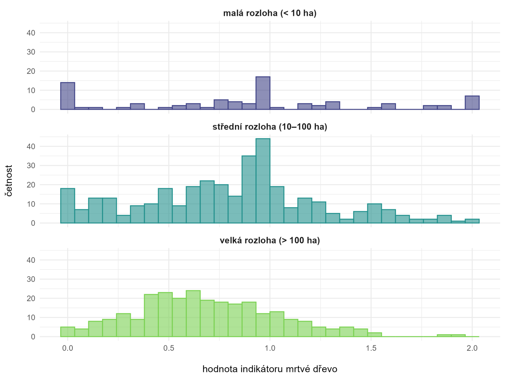

::: {.figcaption}
Dead wood, a forest quality indicator, by site area class – *malá* under 10 ha,
*střední* 10–100 ha, *velká* over 100 ha. *četnost* is the number of sites.
:::
:::

::: {}
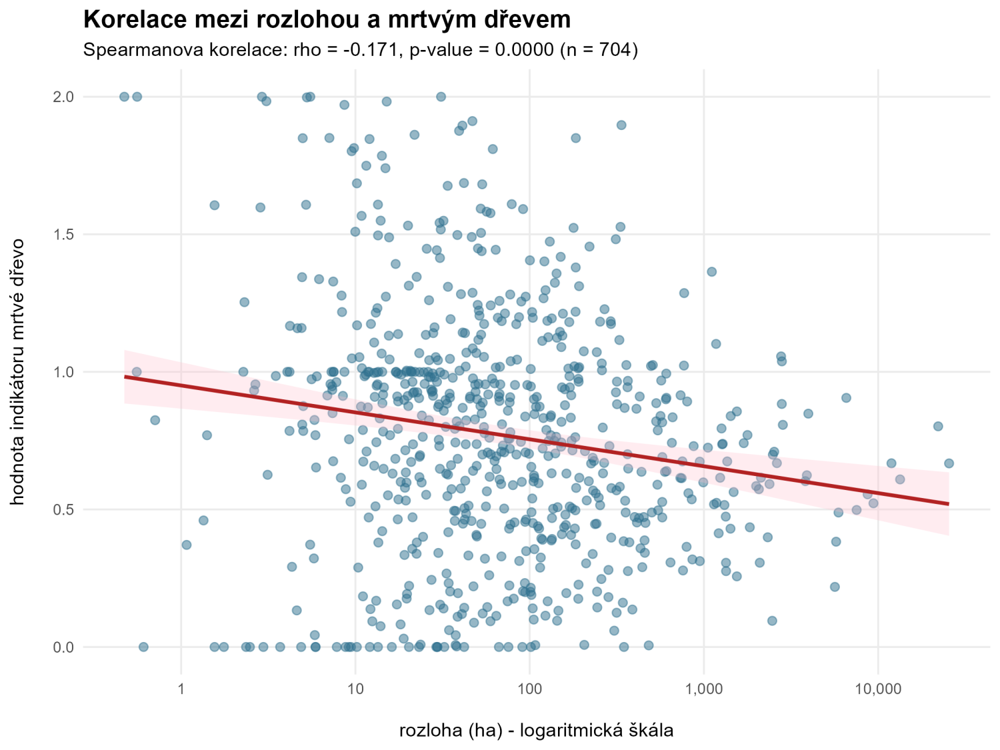

::: {.figcaption}
The same indicator against site area, log scale. Spearman ρ = −0.171,
p < 0.0001, n = 704 – real, and almost nothing.
:::
:::
:::

::: {.smaller}
One threshold for every site would pass and fail partly on size. And
**significant is not large**: at n = 704, ρ = −0.17 clears any p-value you like
while accounting for about 3 % of the spread.
:::

## Validation, and what publication requires {.no-leaf}

::: {.aopk-cols}
::: {}
An **internal process**, in two questions put to the **site manager** or
**regional guarantor** – the person who has stood in the site:

1. **Are the input data complete and accurate?** If not – *not validated:
   faulty data*.
2. **Does the monitoring methodology meet this feature's needs?** If not –
   *not validated: methodological error*.

Both yes → **validated**. Only validated results are published, at
**portal.nature.cz** and carrying their **year**; a class of sites failing the
second question is a finding about the **method**.
:::

::: {}
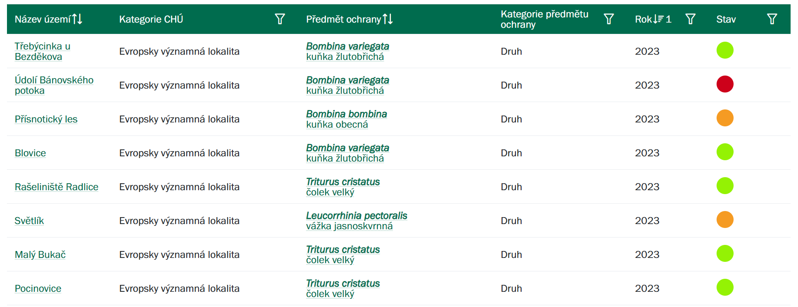

::: {.figcaption}
Validated results on the ISOP Portal: site, site category, target feature,
feature category, year, condition. Columns are filterable and sortable.
:::
:::
:::

## Management effectiveness {.no-leaf}

::: {.aopk-cols}
::: {}
Condition on its own does not tell you whether management is working. Crossing
it with **whether the management plan was actually carried out** does:

| Feature condition | Plan fulfilled | Conclusion |
|---|---|---|
| positive | yes | carry on |
| negative | no | **fulfil the plan** |
| positive | no | **review the plan** |
| negative | yes | **review the plan** |
| insufficient data | – | cannot evaluate |

::: {.smaller}
Other influences are carried alongside: nitrogen and sulphur deposition, mean
annual temperature, deviation from the climate normal, drought, visitor
numbers.
:::
:::

::: {}
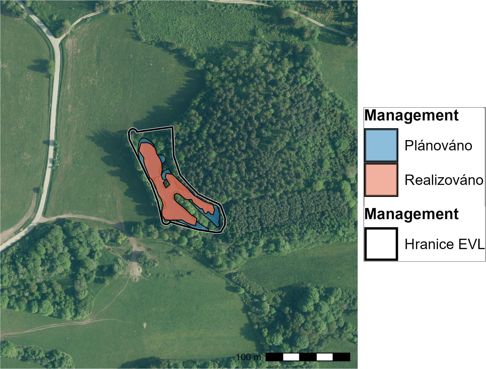

::: {.figcaption}
Planned management (*plánováno*) against implemented management
(*realizováno*) inside one site boundary (*hranice EVL*). Both are polygons, so
the overlap is a number rather than an opinion.
:::
:::
:::

## Results {.no-leaf}

::: {.aopk-pair}
::: {}
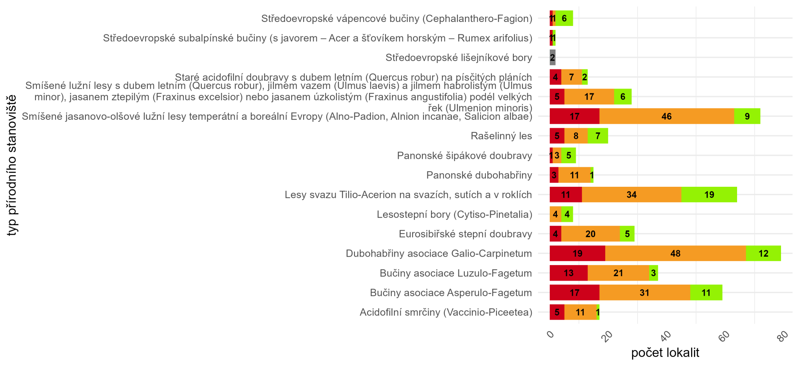

::: {.figcaption}
Forest habitat types by number of sites (*počet lokalit*) in each condition
class – red bad, orange deteriorated, green good.
:::
:::

::: {}
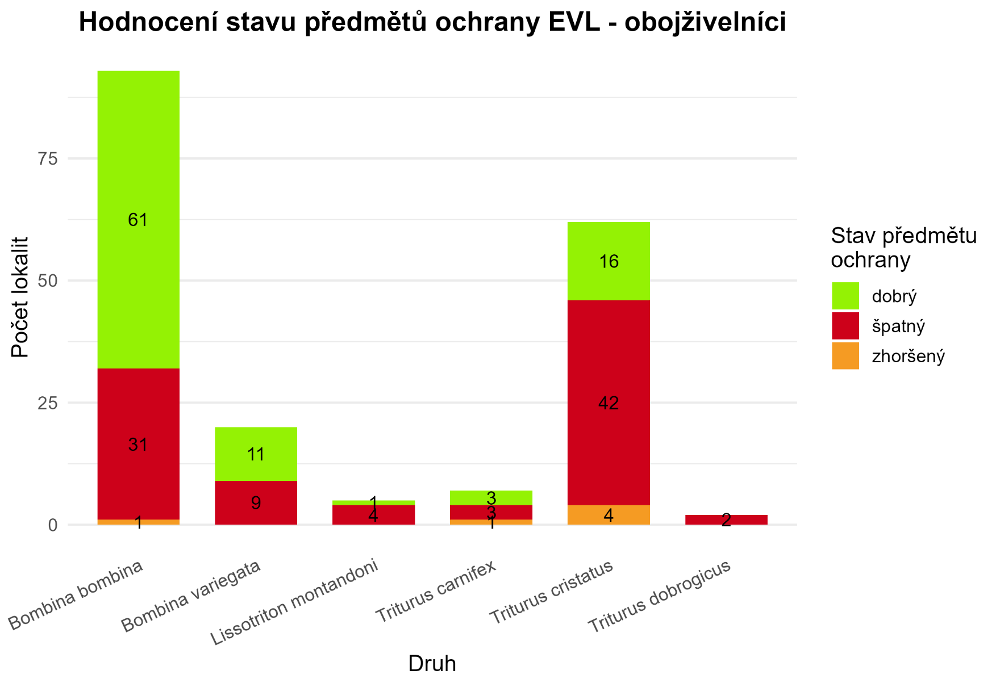

::: {.figcaption}
Amphibian target features by number of sites in each class: *dobrý* good,
*zhoršený* deteriorated, *špatný* bad.
:::
:::
:::

::: {.smaller}
The widespread features carry both the most sites and the most failures, which
is where restoration effort has the most to work with, and where the **Nature
Restoration Regulation** applies. Amphibians are furthest along – revised
methodology, a full pass over the sites, the two-indicator rule applied.
:::

## The evaluation runs as code {.no-leaf}

::: {.aopk-cols}
::: {}
One public R repository, **`BiodivMonCZ/host_naturecz`**, applies the written
rules to the two national holdings. Nothing is done by hand.

- **Re-runnable.** A correction reaches the published result by re-running,
  not by editing it.
- **Attributable.** Every rule change has an author, a date and a diff.
- **The cascade is the method.** `21` records → `22` periods → `23` last
  record → `24` subsites → `25` sites → `27` export; a step that fails stops
  it.
:::

::: {}
**Thresholds are data, not code.** One row per feature × indicator × level:

| Column | Carries |
|---|---|
| `DRUH` | the target feature |
| `ID_IND` | the indicator |
| `TYP_IND` | `min`, `max` or `val` |
| `LIM_IND` | the threshold |
| `JEDNOTKA` | its unit |
| `KLIC` | key indicator? |
| `UROVEN` | subsite or site |

::: {.smaller}
Moving a threshold is an edit to a CSV that can be diffed and reviewed. Nobody
edits a function to change a target.
:::
:::
:::

## What travels {.no-leaf}

::: {.smaller}
- **Write the target down first.** An assessment is only a comparison; without
  a target set in advance it is a description. And it may not sit below the
  condition at designation – a target set there locks in the deficit.
- **Put the rule in a table, not in prose.** A lookup can be diffed, reviewed
  and re-run. A paragraph is re-interpreted by every reader.
- **Compute the spatial relationships; never type them in.** Which site, which
  zone, which district – all of it follows from one geometry and one query, and
  survives the next boundary revision.
- **Record absence, effort and observer.** Without them a dataset shows arrival
  and never decline.
- **Interrogate the indicator before you threshold it** – what it is correlated
  with, and who scored it. Significant is not large.
- **"Unknown" must be a real outcome.** It is how the system commissions its own
  monitoring instead of guessing.
- **Validation by someone who knows the site** is what makes the number
  publishable, and it tests the method at the same time.
- **Keep the evaluation in a repository.** If it is a program rather than a
  spreadsheet, a correction propagates by re-running and every rule change has
  an author.
:::

## {.aopk-closing}

::: {.aopk-mission}

**THANK YOU FOR YOUR ATTENTION!**

portal.nature.cz

:::

::: {.aopk-lockup}

:::

::: {.aopk-web}
aopk.gov.cz
:::
