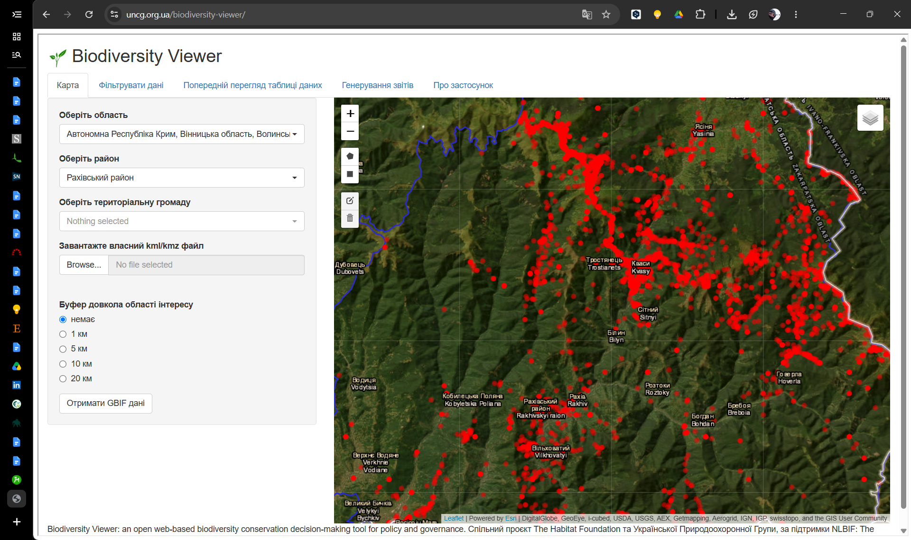

# Analysing spatial data for biodiversity conservation

The Day 1 afternoon keynote for the TAIEX Expert Mission on GIS and biodiversity
data management, Pristina, 28–30 September 2026 (case ID ETT IND/EXP 82606),
built on the same vendored AOPK ČR reveal.js template as the other three decks
in this repository.

| | |
|---|---|
| Slot | Day 1, Monday 28 September 2026, **14:00–14:45** |
| Delivery | **37.5 minutes over 19 content slides**, leaving the balance for questions |
| Source | [`spatial-analysis.qmd`](spatial-analysis.qmd) |
| Slides | `spatial-analysis.html` – reveal.js, 16:9, one self-contained file |
| Handout | `spatial-analysis.pdf` – 22 pages, one slide per page |
| Outline | [`OUTLINE.md`](OUTLINE.md) – **generated**; timings, key messages, visual plan, speaker notes, likely questions, references |
| Plan data | [`data/slide-plan.csv`](data/slide-plan.csv) – one row per slide: minutes, key message, visual and whether it exists |
| Questions | [`questions.md`](questions.md) – authored; appended to the outline |
| Figures | [`make-figures.R`](make-figures.R) builds the record-density map; [`make-eo-figures.R`](make-eo-figures.R) the two Sentinel-2 scenes and the fragmentation map; [`make-sdm-figure.R`](make-sdm-figure.R) the Eros blue model and its ground-truth plots; [`image-slot.lua`](image-slot.lua) stands in for any picture that is missing |
| Sources | [`references.bib`](references.bib) |
| Extra styles | [`spatial-analysis.scss`](spatial-analysis.scss), loaded after [`custom.scss`](custom.scss) |
| Audience | MESPI and KEPA officials, national policymakers, university academics |

The deck was **rebuilt from scratch on 22 September 2026** against a written
brief; only the formatting of the earlier version was kept.

## The argument

Five parts, each one slide-group, each handing over to the next:

1. **The data reality** (slides 1–4). Kosovo's published record is thin and
   concentrated – 28 % of it from one 1.1 km² wetland, 189 protected sites with
   no boundary – and that is *not* a reason to wait: decisions are taken anyway,
   the burden of proof sits with the project, and the satellite archive is a
   baseline that can still be collected retrospectively.
2. **Earth observation** (5–7). Land-cover change from Sentinel-2 and CORINE,
   and fragmentation measures, as the immediate baseline – with the limit stated
   plainly: EO shows where and how much, never which species or what condition.
   Then the way round that limit: a species distribution model for the Eros
   blue (*Polyommatus eros*) that joins the few records there are to WorldClim
   and CORINE, predicts where the butterfly should be, and turns the prediction
   into thirty ground-truth plots – with the GBIF taxonomy trap it fell into
   first.
3. **One system, shared standards** (8–10). Why project data dies on hard drives;
   one central biodiversity information system fed by ministry, universities and
   EIA consultants; Darwin Core and INSPIRE as what makes a record readable by
   strangers and across the Sharri and Bjeshkët e Nemuna borders into the
   neighbours' Emerald Network work.
4. **Three working models** (11–18). The open-data dilemma and the Czech NDOP
   answer (open by default, generalised for sensitive species, precise for named
   users); raw data versus an answer, and the UNCG Biodiversity Viewer that joins
   GBIF to legal status for impact assessment; the great crested newt survey trap
   and English district level licensing as spatial data turned into a priced,
   predictable permit.
5. **Next steps** (19). Govern, build, fund: the twelve months of no-cost
   governance work that produce the baseline, owner and data series funders
   back.

The great crested newt is a deliberate thread: it appears first in the NDOP
full-precision screenshot (slide 14, with recorded absences), and is the
subject of the English case four slides later. Recorded absences are a second
thread: the Eros blue's ground-truth plots (slide 7) are only a validation if
the visits that find nothing are recorded too.

**Three audiences, named explicitly.** Ministry officials need the obligation and
the cheapest first step; policymakers need the economic and permitting argument;
academics need methodological rigour and credit for their data. The notes say
which group a point is aimed at, and the closing notes end on one request to
each.

## Where it sits in the agenda

- **11:10 the same morning**, Martin Koška on the EU nature and digital policy
  framework, and again on **Day 2** on INSPIRE data flows. The interoperability
  slide therefore treats INSPIRE narrowly – as a *services* standard – and says
  so in the notes.
- **11:50 the same morning**, Karel Chobot and the author on biodiversity
  database architecture and data modelling. This deck starts one layer up: not
  how the database is modelled, but what having one changes.
- **Day 2, 15:15**, the author on accessing and using GBIF data. The publishing
  route is stated here and taught there.

---

## Accuracy

**The most important section in this README.** The deck makes claims about three
foreign systems and about Kosovo, and a keynote delivered under an EU instrument
is not the place to be approximately right.

### Kosovo figures – from this repository's pipeline

| Figure | Where it comes from |
|---|---|
| 46,831 occurrence records nationally | `data_exports/kosovo_overall_biodiversity.csv` |
| Ligatina e Hencit / Radevës: 1.1 km², 13,346 records, 28 % | `outputs/national_site_statistics.csv`; recomputed by `make-figures.R` |
| 48 sites with a boundary, 189 point-only; 28 of the 48 hold no record | `geometry_source` and `records` in the same file |
| 237 sites, 1,261 km², 11.6 % of the country | EEA Nationally designated areas, v24 July 2026 |
| The Darwin Core example record | GBIF occurrence 5897424625, as held in the export above |

The record counts are **GBIF-mediated and quality controlled by this
pipeline**; they are what has been *published*, not what is *known*, and the
deck says so out loud.

### The Eros blue model – from `make-sdm-figure.R`, run 28 September 2026

Every number on slide 7 is printed by the script; re-run it and compare before
quoting any of them.

| Figure | Where it comes from |
|---|---|
| 25 Kosovo records in 9 atlas squares, 1 square confirmed since 2007 (2024) | The pipeline extract, selected on `scientificName`; all HabiProt, all 7,071 m uncertainty, i.e. 10 km UTM squares |
| 980 records under the name, 545 *Aricia anteros*, 123 *eroides* | GBIF download [10.15468/dl.265jgv](https://doi.org/10.15468/dl.265jgv), counted on `verbatimScientificName` |
| 31 precise records, six countries (AL 7, BG 4, GR 6, ME 2, MK 8, RS 4), 25 cells | The same download: *P. eros* as written, outside Kosovo, ≤ 1 km or two-decimal coordinates |
| AUC 0.85 (0.83–0.86), Boyce 0.88 | Spatial block cross-validation, 0.5° blocks, 5 folds × 5 repeats, pooled held-out predictions |
| 2,365 km² suitable, 21 % of Kosovo; 699 km² most suitable; 55 % of it in the two national parks | Threshold: the 10th-percentile training presence (0.43); "most suitable" from the median presence (0.77) |
| 8 of 9 atlas squares hold suitable habitat (median 51 % of the square), against 42 of 66 other butterfly squares (median 3 %); AUC 0.82 | The 66 are squares where the same atlas recorded butterflies but not this one. **They are not absences** – say "a check", never "validated" |
| 30 plots: 15 new, 9 revisits, 6 absence tests | `data/sdm-ground-truth-plots.csv`. **Not visited.** The slide says "Next"; the talk must too |

**The taxonomy trap is the reason the slide carries a warning.** The GBIF
backbone, as of 28 September 2026, lists *Aricia anteros* (the Blue Argus, a
different genus) as a heterotypic synonym of *P. eros*, and *P. eroides* as a
synonym too. A query by name or key returns all three; 152 of the first 171
"precise" calibration records were Blue Argus. The script selects on
`verbatimScientificName` and prints the split.

**The same mapping reaches this repository's pipeline** – outside this deck,
but found by it. `data/eu_directives_species.csv` joins *P. eroides* (Habitats
Directive Annexes II and IV) to species key 5140244, *P. eros*'s key, so
`data_exports/kosovo_habitats_directive.csv` and `kosovo_habitats_annex_II.csv`
list all 25 *P. eros* records **and 22 Blue Argus records** as that Annex II
species. Nothing on this deck's slides depends on those exports; anything that
counts Annex II species or records for Kosovo does.

### Checked against primary sources on 22 September 2026

Each of these carries an `urldate` in `references.bib`.

| Claim | Source |
|---|---|
| NDOP: 42,116,850 published records; the great majority public; data provided under contract | NDOP search page; ISOP portal |
| UNCG Biodiversity Viewer: area by admin unit, drawn polygon or KML plus buffer; filters by the Ukrainian Red Data Book, Bern appendices and Resolution 6, Habitats and Birds Directive annexes, Bonn, IUCN, regional lists; CSV/XLSX and HTML/DOCX report; MIT licence; UNCG with The Habitat Foundation, NLBIF-funded; "adapt for any other country" | The repository's `about_en.md`, `Code_Explanation.md` and protected-species list columns |
| District level licensing: red and amber zones; highest-risk (black) areas excluded; no seasonal survey; certificate submitted with the planning application; at least four ponds per occupied pond lost; half of direct costs endowed for 25 years; March–June breeding season | NatureSpace FAQ; GOV.UK scheme page |
| CORINE Land Cover produced for the EEA39, Kosovo included | EEA / CLMS metadata |
| Kosovo Cadastral Agency geoportal launched June 2013, built to INSPIRE standards with search, view and download services | Meha, Crompvoets, Çaka and Pitarka, FIG Working Week 2015 |

**The brief this deck was built from quoted NDOP at "over 24 million records".
That figure is several years old** and is not used; the likely-questions section
explains the difference if someone raises it.

### Still to verify before delivery

| # | Claim | Where it appears |
|---|---|---|
| 1 | The precision NDOP's public view generalises sensitive species to | Slide 13, **visibly flagged on the slide** |
| 2 | NDOP professional-access categories and access logging, as described in the notes | Slide 13 notes – from the author's working knowledge |
| 3 | Which CORINE reference years actually carry Kosovo data. **2018 does** – the Eros blue model reads its grassland polygons inside the boundary; earlier years are unchecked | Not stated on any slide; flagged in the bibliography and the questions |
| 4 | Published evidence on DLL conservation outcomes | Questions only – do not claim delivery without it |
| 5 | A stable URL for the Sofia Declaration on the Green Agenda | Bibliography |
| 6 | The minted DOI of the Kosovo GBIF download | Bibliography; quote the DOI, not the key |
| 7 | An expert look at the 31 *P. eros* calibration records – identification, and the *eros*/*eroides* split in North Macedonia and Bulgaria – before the map is used for anything but choosing plots | Slide 7; the notes say "check, not validation" |
| 8 | The ground-truth protocol (30-minute timed search per 1 km cell, July–August) is a proposal, not an agreed method | `data/sdm-ground-truth-plots.csv` |

### Where the deck deliberately says less than it could

- **Kosovo's international status.** The status designation footnote from the
  TAIEX agenda is reproduced verbatim on slide 1 and nowhere else. No slide
  asserts an obligation on Kosovo under any EU or Council of Europe instrument.
  The Habitats Directive is cited as the standard alignment leads towards; the
  Emerald Network is described through the neighbours, who are Parties.
- **Sentinel revisit intervals.** "Every few days" only.
- **The Eros blue's legal status.** None is claimed. *P. eros* is on no annex
  of the Habitats Directive; *P. eroides*, which GBIF files under the same
  name, is on Annexes II and IV – which is exactly why the two must not be
  merged.
- **The model's map as a distribution.** It is relative habitat suitability,
  and the slide caption says so. It chooses plots; it does not refuse permits.
- **The cost of a system.** No number is given; the questions section says how
  to answer without one.

---

## Building it

### The computed figures

```bash
Rscript make-figures.R
```

Builds `images/kosovo-record-density.png` from the repository's own pipeline
outputs one level up. Needs `sf` and `ggplot2`. Re-run it whenever the pipeline
is re-run, or the map and the numbers beside it drift apart.

```bash
Rscript make-eo-figures.R
```

Builds the Earth-observation figures on slides 5 and 6. Needs `sf`, `terra`,
`jsonlite`, `curl` and `ggplot2`, and – on the first run only – the network: it
downloads open data (no account needed) into `_cache/`, which is git-ignored,
and later runs are offline. About four minutes, most of it labelling forest
patches at 10 m.

- **Change pair** – Sentinel-2 L2A from Microsoft Planetary Computer,
  15 August 2016 and 10 August 2025. Both scenes come from the same satellite
  on the same orbit, and they share one fixed stretch. The script corrects the
  −1000 offset that processing baseline 04.00 added to newer scenes, which
  would otherwise make 2025 look brighter. The 5 km window is on the park's
  eastern edge at the mouth of the Rugova gorge. It was **chosen by eye, not
  by an index**: an NDVI difference there is dominated by the 2025 drought on
  the farmland outside the park.
- **Fragmentation** – CLC+ Backbone 2021 forest (classes 2–4) from the EEA
  image service, with OpenStreetMap motorways and main roads burnt in as
  barriers. The script prints the patch statistics quoted in the notes:
  9,370 patches; the two largest are 174 and 156 km² and lie either side of
  the gorge; the effective mesh size is 97 km². **Do not quote a "with and
  without roads" difference.** At 10 m, CLC+ already maps the motorway
  corridor as a gap in the forest, so burning the roads in moves the mesh
  size by under 1 %.

```bash
Rscript make-sdm-figure.R
```

Builds the Eros blue model on slide 7 and writes the figure and the
ground-truth plot list `data/sdm-ground-truth-plots.csv` (Darwin Core-shaped,
with `occurrenceStatus` left blank for the field team). Same packages as
above; about a minute once `_cache/` is filled. The first run reads the GBIF
archive for the key in `data/sdm-gbif-download-key.txt` – fetching an existing
download needs no account, and the script never requests a new one, so the DOI
cited on the slide stays the one the numbers came from. It also pages about
10,000 CORINE 2018 polygons from the EEA map service and reads a Balkan window
of the WorldClim 2.1 30″ tile directly from the geodata server. The head of
the script explains the choices: why the model is calibrated outside Kosovo,
the ensemble of small models, and the three validation layers.

### Slides

```bash
quarto render spatial-analysis.qmd --to aopk-revealjs
```

This directory carries its own `_quarto.yml`, so it is a **separate Quarto
project** from the website in the repository root and from the other three deck
directories. Rendering it does not touch `docs/`, and `quarto render` at the root
skips it – see the `render:` list in the root `_quarto.yml`.

The deck itself needs **only Quarto**: it has no R chunks. The Kosovo figures are
written into the slide as text rather than computed, because they come from a
pipeline run that is not part of this project and freezing a number is the
point.

### The outline

```bash
Rscript build-outline.R
```

`OUTLINE.md` is **generated and must not be edited**. It is built from
`spatial-analysis.qmd` (slide titles and the `::: notes` blocks),
`data/slide-plan.csv` (timings, key messages, visuals), `questions.md` and
`references.bib`. The script stops rather than writing a wrong file if
`slide-plan.csv` and the deck disagree on how many content slides there are.

### Handout

Quarto has no reveal.js → PDF converter. reveal.js prints itself when the page is
opened with `?print-pdf`, so the handout is produced by driving a headless
browser over the rendered slides:

```bash
chrome --headless=new --disable-gpu --no-pdf-header-footer \
       --allow-file-access-from-files \
       --run-all-compositor-stages-before-draw \
       --virtual-time-budget=90000 \
       --print-to-pdf=spatial-analysis.pdf \
       "file:///ABSOLUTE/PATH/TO/spatial-analysis.html?print-pdf"
```

`--virtual-time-budget` matters: the flowchart is laid out by JavaScript at load
time, so a print that fires early gets a page with the diagram missing or half
drawn. Render the slides first: the PDF is printed *from* the HTML.

### Publishing

Rendering the website at the repository root copies both built files into
`docs/slides/spatial-analysis/` and lists the deck on the site's landing page,
from the deck's row in [`../data/workshop_decks.csv`](../data/workshop_decks.csv).
After rebuilding the deck alone, republish it from the repository root without
re-rendering the site:

```bash
Rscript publish_slides.R
```

**Do not publish while any placeholder box remains** (see "Figures").
`publish_slides.R` enforces this: it stops if the built slides still hold one.

---

## Figures

Every picture is written into the `.qmd` as the real thing, with two extra
attributes:

```markdown
{slot="16/10" want="The viewer with an area..."}
```

[`image-slot.lua`](image-slot.lua) checks at render time whether the file
exists. If it does, the image passes through untouched. If not, it is replaced
by a red dashed box of the `slot` aspect ratio that names the file and repeats
the `want` brief. **Dropping the file into `images/` and re-rendering is the
whole of the work** – no slide is edited.

| File | Slide | Status | What it must show |
|---|---|---|---|
| `kosovo-record-density.png` | 3 | **exists** – `make-figures.R` | Records per km² by municipality, protected sites, Ligatina e Hencit ringed |
| `ndop-full-precision.png` | 14 | **exists** – cropped from the n2k deck's `ndop-record-list.png` | NDOP logged-in list, *Triturus cristatus*, NEG absences |
| `eo-change-before.jpg` | 5 | **exists** – `make-eo-figures.R` | Sentinel-2, 15 Aug 2016, 5 km of the Bjeshkët e Nemuna park edge above Pejë |
| `eo-change-after.jpg` | 5 | **exists** – `make-eo-figures.R` | The same extent, 10 Aug 2025: a new road through the forest inside the park |
| `fragmentation.png` | 6 | **exists** – `make-eo-figures.R` | CLC+ Backbone 2021 forest patches at the Kaçanik gorge, R6 and main roads |
| `sdm-polyommatus-eros.png` | 7 | **exists** – `make-sdm-figure.R` | Relative suitability for the Eros blue across Kosovo, the nine atlas squares, the two national parks and the 30 ground-truth plots |
| `ndop-public-generalised.png` | 13 | **exists** – captured | NDOP public view of a sensitive species, generalised to a square |
| `uncg-viewer-report.png` | 15 | **exists** – captured | The viewer's species/legal-status table for one area |
| `uncg-viewer-map.png` | 16 | **exists** – captured | The viewer with an area selected, filtered records, filter panel |
| `dll-risk-zones.png` | 18 | **exists** – supplied | A published GCN impact risk zone map; **reuse licence still to be checked** |

Three things are drawn in the slide itself rather than as pictures, so they
cannot come out too small: the Darwin Core record (slide 10), the raw CSV
(slide 15) and the survey calendar (slide 17).

### Legibility – the rule every picture has to meet

**Text inside a picture must land at 16 px or more on the 1280 × 720 canvas.**
Body text is 25.9 px; below about 14 px nothing can be read past the second
row. Before accepting a picture, render the deck and look at the *slide*, not
the file – the first build of the Kosovo map looked fine as a PNG and landed at
11 px on the slide.

The space each picture actually gets:

| Layout | Used on | Picture box on the canvas |
|---|---|---|
| `.aopk-cols` (54 % column) | 3, 7, 13, 18 | ≈ 610 × 370 px – height binds for anything squarer than 1.6:1 |
| `.aopk-cols-wide` (64 % column) | 6, 16 | ≈ 720 × 400 px |
| `.aopk-pair` (half each) | 5, 15 | ≈ 550 × 340 px – but a 16:10 picture is height-capped at ≈ 430 × 270 (measured on slide 5) |
| full width | 14 | ≈ 1130 × 400 px – for very wide strips such as a table |

**For screenshots**, that means: set the browser to 100 % zoom, crop to the
region that matters – never the whole window – and keep the crop no wider than
the box above in CSS pixels (so about 720 px wide for slide 16). Capture on a
high-density screen or with device-pixel-ratio 2, so the file is twice that and
stays sharp on a projector. A full-window screenshot shrunk into a column is the
single most common reason slide text becomes unreadable.

---

## Checking it before it is given

A slide that overflows the safe area is not warned about by Quarto, so this
check is not optional.

```bash
pdftoppm -r 60 -png spatial-analysis.pdf page-dir/page
Rscript check-overflow.R page-dir
```

[`check-overflow.R`](check-overflow.R) scores the strip immediately **above** the
footer bar on each page. It needs the `png` package and nothing else. The logic,
and the two dead ends that preceded it:

- The bar is `$aopk-footer-h`, 65.3 px of the 720 px canvas – the bottom 9.07 %.
- **Do not look inside the bar.** The bar is opaque and is painted *on top of*
  the content, so overflowing text is not printed through it – it is cut off by
  it, and the bar itself comes out pixel-perfect.
- Look instead at a strip about 8 px **above** the bar top, masking out the
  right-hand fifth where the dvojlist leaf legitimately sits.
- On a clean build every content page scores 0.

The `.aopk-section` dividers, the title slide and the closing slide carry
different furniture at the foot by design and always score high. Read those by
eye. **The Sources slide is the tightest in the deck** – on the rebuild it
overflowed until the one-line VERIFY note beneath the bibliography was removed,
and the two species-model sources pushed it over again until its type went
from 0.47 to 0.45 of body size. Re-check it after any change to
`references.bib`, **and look at it**: an entry that lands wholly under the
footer bar leaves the strip above the bar clean and scores 0. The Eros blue
slide's closing line was lost the same way on its first build.

Placeholder boxes reserve their picture's aspect ratio under the same height cap
as a real figure, so the check is meaningful before the pictures exist – but
re-run it once they arrive, because a real caption may be longer.

### Pacing

```bash
Rscript check-pacing.R
```

The notes are written as full spoken prose, so their word count estimates how
long the talk runs. The target is **120–140 words per allotted minute** – slower
than a native-speaker default, because this audience hears the talk in a second
language. With the species-model slide the deck sits at about 4,925 words over
37.5 minutes, 131 wpm, with no slide above 150. **Run this after any edit to the notes.** If the timings change, change them
in `data/slide-plan.csv`; the script reads the budget from there.

---

## Notes on the styles

The AOPK extension in [`_extensions/aopk/`](_extensions/aopk) is vendored from
the graphic manual and is not modified here. It is the same copy as in the three
sibling decks, as is [`custom.scss`](custom.scss); keep them in step if the
template is revised.

**Dashes.** The deck uses spaced en dashes (–) throughout, never em dashes. The
vendored template's own comments are left as they are.

[`spatial-analysis.scss`](spatial-analysis.scss) documents each block where it is
defined. The ones worth knowing before editing:

- **`.aopk-cols-wide`** gives a screenshot 64 % of the width. The theme's 54 %
  column shrinks a browser window's text below legibility.
- **Figure captions are 16 px** (0.62 of body), not the siblings' 13 px, and the
  figure height cap reserves 3.6em for them rather than 4.6em.
- **`.aopk-pair` children carry `min-width: 0`.** Without it, the raw CSV's
  unbreakable 100-character line widened its column until the second one was a
  sliver.
- **The Mermaid flowchart has two geometries, not one** – a screen layout and a
  taller print layout – and mermaid's inline `max-width` defeats any percentage
  above the diagram's natural width. The current ratios and the arithmetic for
  the 72 % cap are in the SCSS. Re-derive both if a node or label changes:

  ```bash
  chrome --headless=new --dump-dom spatial-analysis.html             | grep -o 'viewBox="[^"]*"'
  chrome --headless=new --dump-dom 'spatial-analysis.html?print-pdf' | grep -o 'viewBox="[^"]*"'
  ```
