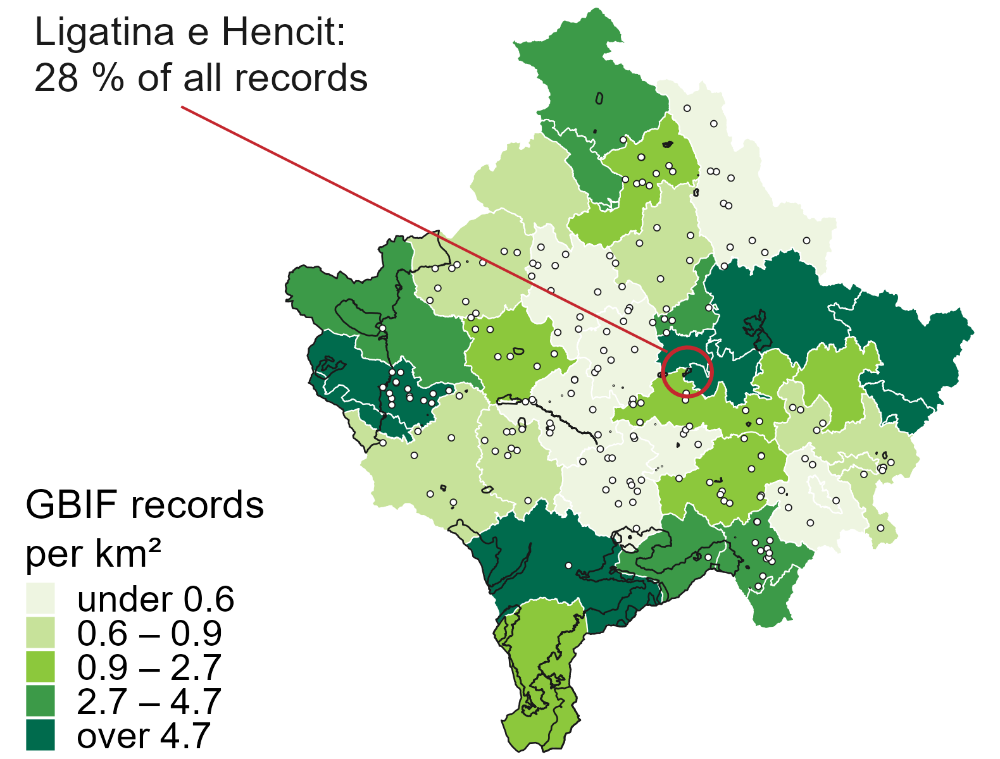
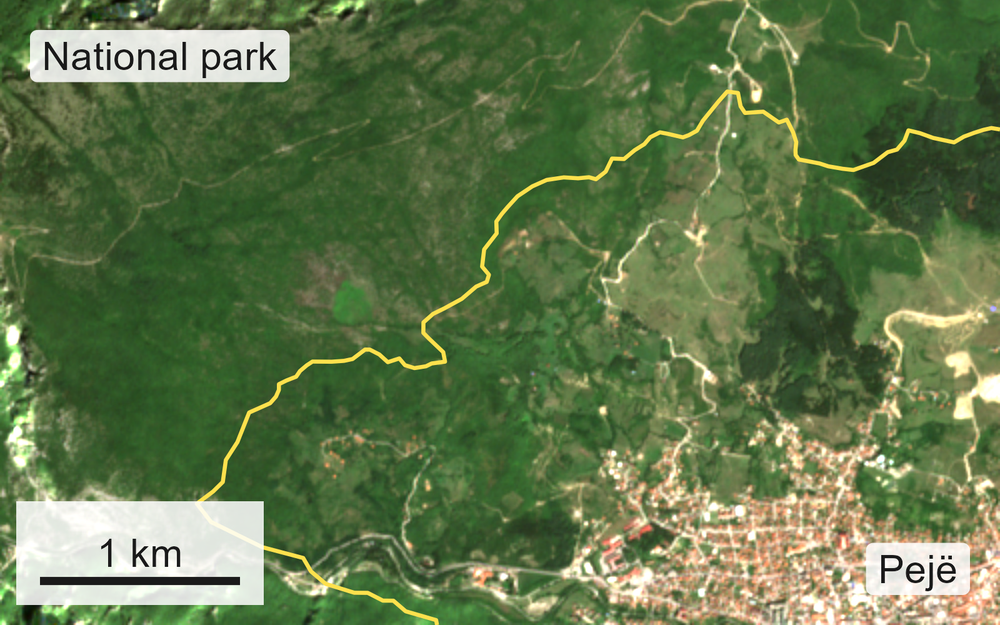
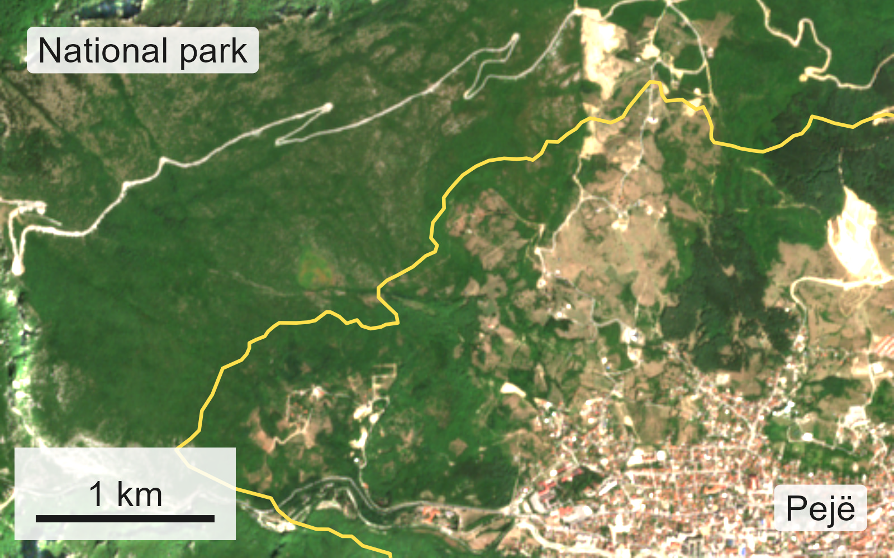
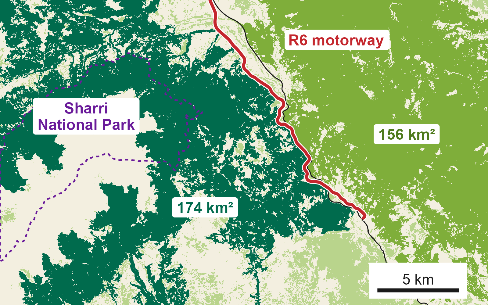
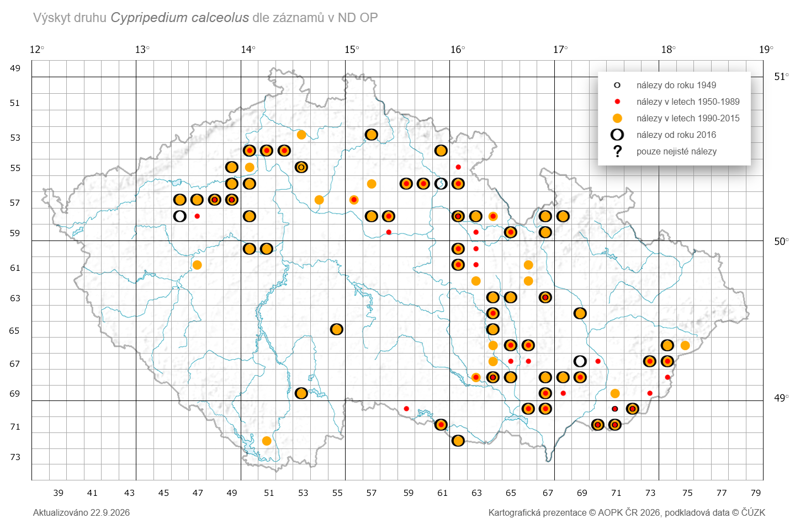
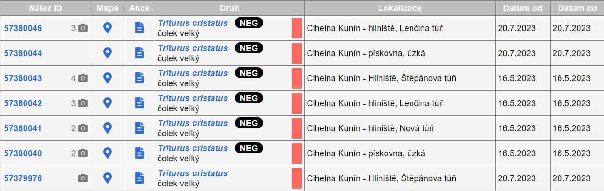
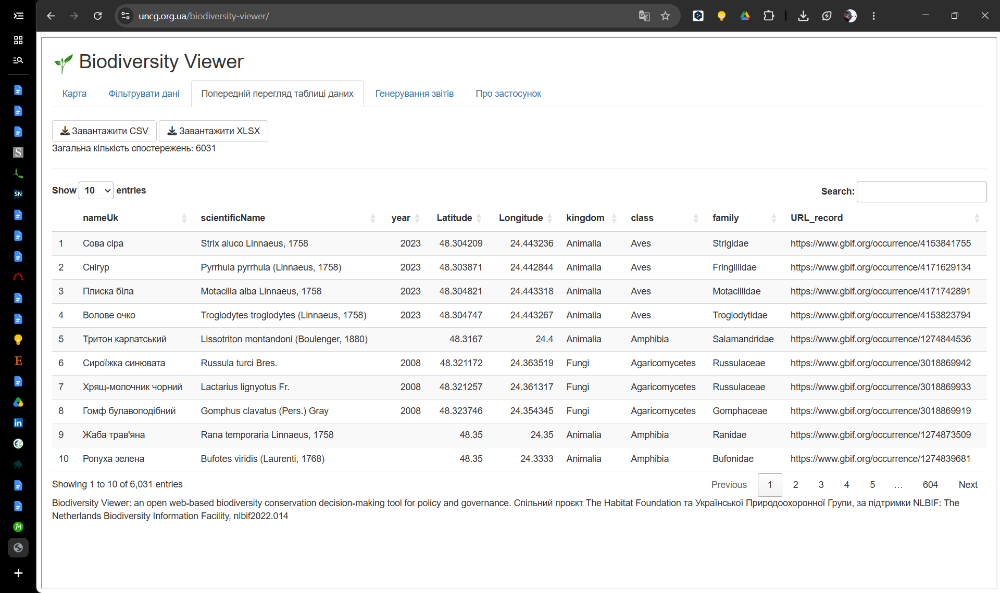
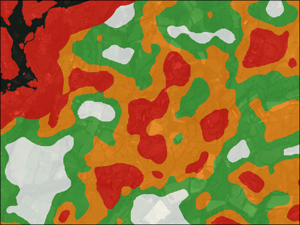

## What this session covers

- **The data reality** – what Kosovo's published record shows, and why a thin
  baseline is no reason to wait.
- **Earth observation** – land-cover change and habitat fragmentation from
  Copernicus, available today at no cost.
- **One system, shared standards** – from project hard drives to a central
  biodiversity information system built on Darwin Core and INSPIRE.
- **Three working models** – Czech tiered open data, a Ukrainian GBIF viewer
  for impact assessment, English district level licensing.
- **Next steps** – what makes Kosovo's nature data fundable.

::: {.note}
Kosovo\* – this designation is without prejudice to positions on status, and is
in line with UNSCR 1244/1999 and the ICJ Opinion on the Kosovo declaration of
independence.
:::

::: notes
Good afternoon. This morning Karel and Martin covered how a monitoring scheme is
designed and how the database behind it is modelled. I take the layer above
that: what spatial data does for decisions – and for money.

There are three groups in this room, and each needs something different from
the next thirty-five minutes. For the ministry: what alignment with European
practice asks of you, and the cheapest first step towards it. For policymakers:
how data reduces risk and cost in permitting and investment. For the academics:
standards rigorous enough that your data survives outside your own
spreadsheet, and keeps your name on it. I will say when a point is aimed at
one of you.

Five parts, ending on what makes Kosovo's nature data fundable. Let me start
with the uncomfortable part.
:::

## No baseline is not a reason to wait {.aopk-section}

Permits, road alignments and quarry extensions are decided this week, with or
without a map. Data does not add a decision – it makes the one being taken
checkable.

::: notes
One idea before any evidence, because everything else hangs from it. Somewhere
in this country this week a permit is being signed, and in that file there is a
biodiversity question. It is being answered today – from data, or from memory.
The question is only whether the answer can be checked.
:::

## Kosovo's published record: thin, and concentrated {.no-leaf}

::: {.aopk-cols}
::: {}
- **46,831** GBIF records – about **four per km²**.
- **28 %** of them come from **one wetland of 1.1 km²**.
- **48** protected sites have a boundary; **28** of those hold **no record**.
- **189** sites exist only as **a point** – nothing to intersect, report on
  or defend.

::: {.smaller}
*Published* is not *known*: theses and survey reports hold far more, unseen.
:::
:::

::: {}


::: {.figcaption}
Records per km² by municipality. Outlined: the 48 sites with a boundary.
Circles: the 189 point-only sites. GBIF extract behind this repository's
report; sites from the EEA register, v24, July 2026.
:::
:::
:::

::: notes
These numbers do not come from a policy document. They come from an analysis of
this country's own published record, and the code is in a public repository,
so every one of them can be checked.

Forty-six thousand records for almost eleven thousand square kilometres. That is
thin, and I will not pretend otherwise. But the shape matters more than the
size. Look at the red ring. Twenty-eight per cent of everything ever published
for Kosovo comes from a single wetland of just over one square kilometre,
Ligatina e Hencit. That is not a statement about Kosovo's nature. It is a
statement about where birdwatchers go.

Then the protected areas – and this is the point for the ministry. Of the
forty-eight sites with a mapped boundary, twenty-eight have no record inside
them at all. And a hundred and eighty-nine more exist in the European register
only as a single coordinate, the small circles on the map. A protected area
without a polygon cannot be intersected with anything. You cannot ask what is
inside it, you cannot report on it, and you cannot defend it when a
development is proposed next to it.

For the academics: forty-six thousand is what has been *published*, not what
is *known*. There are theses, expedition reports and consultants' surveys in
this country that hold far more. Not missing – just invisible, which for a
planner is the same thing.

And for everyone: this is a normal starting point, not a failure. The Czech
database I will show you later began as card indexes and project reports in
filing cabinets. Almost every European country has been here. What changed
things was not money or talent. It was a decision about where the data would
live.

So the field gap is real. The question is whether it is a reason to wait.
:::

## A missing baseline is not a reason for inaction

::: {.aopk-trio}
::: {}
**Decisions are taken anyway**

Every impact assessment and permit already answers the biodiversity question –
from data, or from a site visit somebody remembers.

The choice is between an answer that can be checked and one that cannot.
:::

::: {}
**"No record" is not "no species"**

Under the Habitats Directive the burden sits with the project: it must show,
beyond reasonable scientific doubt, that a site will not be harmed.

A blank map is a risk to the developer and to the ministry – not a clean bill
of health.
:::

::: {}
**The past can still be observed**

Nobody can survey 2016 again. The satellites already did – at 10 m, every few
days, since 2015.

The Earth-observation archive is the one baseline that can still be collected
**retrospectively**.
:::
:::

::: {.smaller}
Start with the evidence that already exists for the whole territory and costs
nothing.
:::

::: notes
I hear one argument in every country at this stage: we cannot act until we have
a proper baseline. I want to take it apart, because it sounds responsible and
it is the most expensive position available.

First: decisions are being taken anyway. Every impact assessment and every
permit already answers the biodiversity question. Waiting for a baseline does
not postpone those decisions. It only means they are taken on evidence nobody
can check.

Second – and this is for the ministry. Under the Habitats Directive, the burden
of proof does not sit with nature. A plan affecting a protected site has to
show, beyond reasonable scientific doubt, that the site's integrity will not be
harmed. The European Court of Justice set that test in the Waddenzee case. In
that framework, a blank map does not mean "go ahead". It means the developer
cannot discharge the burden, and the decision becomes contestable. Missing data
is a legal and financial risk – for the investor and for the ministry that
signed.

Third, and this is the practical point. You cannot go back and survey 2016. But
the Sentinel satellites did. Since 2015, every few days, at ten-metre
resolution, over every hectare of this country. That archive is the one
baseline that can still be collected after the fact – and it is free.

The same logic answers the ministry's question on network sufficiency without
national totals: give the total as a range, judge on the less favourable end,
and where research is still needed, use the EU's own code for it – scientific
reserve.

So the answer to "we have no baseline" is: you have more of one than you think.
:::

## Land-cover change from Copernicus {.no-leaf}

::: {.aopk-pair}
::: {}
{slot="16/10" want="Sentinel-2 true colour, summer 2016, one Kosovo extent with visible land-take (suggested: the lignite fields west of Obiliq, or the Pristina urban fringe). Same extent and scale as the 'after' image."}

::: {.figcaption}
Sentinel-2, summer 2016. *[Place and date to be set when the scene is chosen.]*
:::
:::

::: {}
{slot="16/10" want="The same extent, summer 2025, same band combination and stretch."}

::: {.figcaption}
The same extent, summer 2025.
:::
:::
:::

::: {.smaller}
**Sentinel-2** – 10 m, free, archive from 2015. **CORINE Land Cover** –
harmonised classes and change layers for 39 European countries, Kosovo
included. Together: *where* land cover changed, *how much*, and *when*.
:::

::: notes
Here is what that archive looks like in practice. The same piece of Kosovo, the
same season, nine years apart. You do not need to be a remote-sensing
specialist to read this slide – and that is the point. A minister can read it.

Two products carry most of the value. Sentinel-2 gives ten-metre optical imagery
of the whole country every few days, free and openly licensed, back to 2015.
It is the raw evidence. CORINE Land Cover is the interpreted layer: a
harmonised land-cover map, with change layers between reference years, produced
by the European Environment Agency for thirty-nine countries – and Kosovo is
inside that extent. That matters: your land-cover classes are the same classes
your neighbours and the EU use, so a comparison across a border needs no
translation.

What does this buy the ministry? A land-cover change map for the whole
territory: where forest, grassland or wetland became something else, how much,
and when. That is the baseline the next impact assessment can be measured
against. Today, when an assessment says the site is unchanged, you take the
assessor's word for it. With this, you can check.

For the academics, a word on rigour. Change detection from satellite imagery
has error, and it must be validated against ground reference points – a
classification without an accuracy assessment is a picture, not evidence. But
that validation is a normal, publishable piece of work, and a good thesis
topic.

Land cover tells you how much habitat there is. The next question is whether it
still functions as habitat – and that is about its shape.
:::

## Fragmentation: connection, not just cover {.no-leaf}

::: {.aopk-cols-wide}
::: {.smaller}
- **Patch size and isolation** – how much habitat, in how many pieces, how far
  apart.
- **Effective mesh size** – the chance that two random points are still
  connected; the EEA's fragmentation measure.
- **Barriers** – motorways, fenced corridors, reservoirs, from the road and
  water network.

**What it cannot see:** species, habitat condition, anything under a canopy or
in a cave. It tells field teams **where** to go – it does not replace them.
:::

::: {}
{slot="16/10" want="A fragmentation map for one Kosovo landscape: forest (or grassland) patches from a Copernicus layer, e.g. Tree Cover Density or CLC+ Backbone, with motorways and main roads drawn over them. Suggested: the R7 motorway corridor, or the edge of Sharri National Park."}

::: {.figcaption}
Habitat patches and the barriers between them. *[Layer, year and extent to be
set when the map is made.]*
:::
:::
:::

::: notes
Fragmentation is the harder concept and the more important one for species. A
forest can keep its total area and still fail as habitat, if a motorway cuts it
into pieces too small or too isolated for the animals that need it. Bears, lynx
and amphibians care less about hectares than about getting from one piece to the
next.

Three measures do most of the work. Patch size and isolation: how much habitat,
in how many pieces, how far apart. Effective mesh size: one number for how
connected a landscape still is. The European Environment Agency uses it across
Europe, so Kosovo's figure can sit in the same table as its neighbours'. And
barriers: roads, fences, reservoirs.

For policymakers: this is how you see, before a motorway is built, which
alignment cuts a corridor and which runs along an existing one. That is cheaper
to learn on a map than in a court.

Now the limit, bluntly: satellites cannot replace the field programme. There is
no spectral signature for a yellow-bellied toad, and no band combination that
finds a bat roost. Earth observation answers *where* and *how much*. Field survey
answers *what* and *in what condition*. The first tells you where to spend the
second – that is what makes a small field budget behave like a larger one.

And when a Natura 2000 boundary comes to be drawn, these are the edges it should
follow – a habitat patch, a watershed, a road – never the edge of a screening
grid cell. The grid says where to look; the boundary comes from the ground.

Which raises the next question: where does the field data go once collected?
:::

## Why project data dies on hard drives {.no-leaf}

::: {.aopk-cols}
::: {}
**The pattern – in every country, mine included**

1. A project is funded; a consultant or a university team surveys.
2. The deliverable is **a report**. The data is an annex, or a file on a
   laptop.
3. The project closes. The laptop is replaced.
4. Five years later the same valley is surveyed again, because nobody could
   find the first survey.
:::

::: {}
**What it costs**

- **You pay twice**, with public money, for what you already knew.
- **You get no trend.** Two surveys that cannot be compared are not a time
  series – and trend is what reporting asks for.
- **You cannot defend a decision.** An assessment challenged in court needs the
  records, not a PDF conclusion.
- **Nobody gets credit**, so nobody hands anything over.
:::
:::

::: {.smaller}
Not a discipline problem – **a missing destination**.
:::

::: notes
I want to describe a pattern and ask you afterwards how much of it you
recognise. In my experience it is nearly universal – I am describing my own
institution thirty years ago.

A project is funded. Good people do good fieldwork. The contract says the
deliverable is a report, so a report is what is delivered, and the data sits in
an annex or on a hard drive. The project closes, the laptop is replaced, and
five years later somebody commissions a survey of the same valley, because
there is no way to discover that the first one ever happened.

Look at the costs, because they are specific and they are budgetable. You pay
twice – a direct fiscal loss. You get no trend: every reporting framework in
this field asks how things are changing, and two surveys with different methods
and no shared records cannot answer that. You cannot defend a decision: when an
impact assessment is challenged, the defence is the underlying record, and a
conclusion with no data behind it loses. And nobody gets credit, so the
researcher has no reason to hand anything over.

The line at the bottom is the one I came to say. This is not solved by telling
people to be tidier. A researcher with nowhere to deposit data who keeps it on a
personal drive is behaving rationally. There is no destination. Build one that
is easy to use and gives credit, and the behaviour changes without anyone being
instructed.

So what does the destination look like?
:::

## One central Biodiversity Information System {.no-leaf .diagram-tall}

```{mermaid}
flowchart LR
  M["<b>Ministry and KEPA</b><br>monitoring, site surveys"] --> DWC
  U["<b>Universities</b><br>theses, field seasons"] --> DWC
  C["<b>EIA consultants</b><br>the survey data,<br>not only the report"] --> DWC
  DWC["<b>Darwin Core</b><br>mapped once"] --> BIS["<b>National Biodiversity<br>Information System</b><br>one authoritative,<br>versioned copy,<br>permanent IDs"]
  BIS --> G["<b>Published to GBIF</b><br>a DOI, credit to authors"]
  BIS --> E["<b>EIA screening</b><br>full precision, named users"]
  BIS --> R["<b>Reporting</b><br>national, EU, transboundary"]
```

::: notes
The whole architecture on one slide, deliberately boring: the important property
is that there is exactly one box in the middle.

On the left, the three places biodiversity data is produced in Kosovo today: the
ministry and the environmental protection agency's own monitoring; the
universities' theses and field seasons; and – the one usually forgotten – the
consultants who survey for impact assessments. Public money or a public permit
pays for all of those surveys, so require the data, not only the report. That is a clause in a contract, not a law.

Each source is mapped to Darwin Core once – for a spreadsheet, an afternoon –
and deposited in one national system that keeps one
authoritative, versioned copy. The ministry asked what that copy needs: a
permanent identifier on every record, so a correction can be traced; its source
stored as fields; and duplicates linked, not deleted. Kosovo's published record
already holds seventy-seven observations published twice.

What comes out: the same record doing three jobs. It is published
to GBIF with a DOI, and the citation returns to the person who collected it –
the academics' return. It becomes a screening layer for impact assessment, at
full precision, for named users – the ministry's return. And it
feeds reporting, *built* from the system rather than re-collected every few
years – that is where the saving appears on a budget.

The failure to avoid: three outputs, three databases, because the EIA layer was
thought to need separate handling. They diverge within a year, and you have
three answers to one question and no way to say which is right.

What makes one system possible is a shared language.
:::

## Interoperability: one record, across borders {.no-leaf}

::: {.aopk-cols}
::: {.smaller}
**Darwin Core** – what a record *is*. The same terms in Pristina, Prague and
Skopje, so records merge without a telephone call.

**INSPIRE** – how spatial data is *served*: *Protected sites*, *Species
distribution*, *Habitats and biotopes*. The Kosovo Cadastral Agency's geoportal
has run INSPIRE-based services since 2013.

**Across borders** – Sharri and Bjeshkët e Nemuna continue into North
Macedonia, Albania and Montenegro, which are building the Bern Convention's
**Emerald Network**. Shared standards let assessments meet at the border.
:::

::: {}
::: {.dwc}
| Term | Value |
|---|---|
| scientificName | *Bombina variegata variegata* |
| eventDate | 2025-06-18T07:04 |
| decimalLatitude | 41.93105 |
| decimalLongitude | 20.69826 |
| coordinateUncertaintyInMeters | 200 |
| basisOfRecord | HumanObservation |
| occurrenceStatus | present |
| license | CC BY-NC 4.0 |
:::

::: {.figcaption}
One real Kosovo record in Darwin Core: yellow-bellied toad, Sharri National
Park, June 2025 (GBIF occurrence 5897424625). Habitats Directive Annexes II
and IV.
:::
:::
:::

::: notes
Three standards, usually presented as bureaucratic burden. I want to present
them as what makes a record usable by somebody who has never met you.

On the right is a real record from this country, as GBIF holds it: a
yellow-bellied toad in Sharri National Park, last June. Darwin Core is simply
the agreed name for each of those fields. Because the names mean the same thing
in Pristina, Prague and Skopje, a record can be merged with anyone else's
without a telephone call.

For the academics, two fields that do more work than the rest.
Coordinate uncertainty – here, two hundred metres – because a record without a
stated precision cannot be used safely: people either discard it or, worse,
trust it. And occurrence status, because it lets you record an *absence*. A
dataset with no absences shows species arriving and never declining, which is
the opposite of what monitoring is for.

INSPIRE is the services layer – how spatial data is found, viewed and
downloaded. Martin covered the policy frame this morning and returns to data
flows tomorrow, so only the strategic point, for the ministry. Kosovo does not
start from zero: the Kosovo Cadastral Agency's geoportal has run services built
on INSPIRE standards since 2013. The biodiversity layers – protected sites,
species distribution, habitats – should be published *through* that
infrastructure, not beside it.

And transboundary. Sharri continues into North Macedonia and Albania;
Bjeshkët e Nemuna into Albania and Montenegro. Those neighbours are Parties to
the Bern Convention and are building the Emerald Network, the European network
of Areas of Special Conservation Interest. A bear or a lynx population does not
stop at a border, and neither should its assessment. If Kosovo's records follow
the same standards, they join the neighbours' work without translation – and a
joint, cross-border proposal is exactly what international funders like to
see.

That is the architecture. Now three systems that make it work.
:::

## Three systems that work {.aopk-section}

A Czech database that is open without being reckless. A Ukrainian viewer that
turns GBIF into an answer. An English licence that turned newt surveys into
faster permits.

::: notes
Three examples, each chosen because it solves one problem Kosovo has today. The
first addresses the question I am asked in every country, usually in the first
ten minutes: is it safe to publish any of this?
:::

## The open-data dilemma

::: {.aopk-cols}
::: {}
**The fear is legitimate**

Orchids dug up, raptor nests robbed, tortoises taken, cave fauna collected.
Precise public localities *have* been misused, in several countries.

Anyone who waves this away has not dealt with it.
:::

::: {}
**But closing the data protects the wrong people**

- The collector **already knows the site**. The road engineer does not.
- To a planner, a site with no record is **an empty field**.
- Most sites are lost not to a poacher, but to **a bulldozer and a blank
  map** – lawfully.
:::
:::

::: {.smaller}
The question is not *open or closed*. It is **who sees what, at what
precision**.
:::

::: notes
The objection: if you publish exact coordinates for rare species, you help the
people who collect them. And sometimes that is simply true. Orchids have been
dug up, raptor nests robbed, tortoises taken for the pet trade, cave
invertebrates collected to local extinction. In Czechia there are species whose
precise localities I would not publish under any circumstances.

But the usual conclusion – therefore publish nothing – fails on its own terms.
Consider who is actually kept in the dark. The specialist collector already
knows the site; they have been going there for fifteen years and do not need
your database. The person who does not know is the engineer routing a road, or
the official processing a quarry extension. Closing the data works very well –
against exactly the wrong audience.

And for the ministry, the sentence that matters most. To a planner, a site with
no record in the system looks exactly like an empty field. That is how most
sites are actually lost: not to a man with a spade, but to a bulldozer and a
blank map, entirely lawfully, because nothing in the file said anything was
there.

So the real question is not open versus closed. It is governance: who sees what,
at what precision, under what agreement. The Czech answer is a working example.
:::

## NDOP: open by default, precise by permission {.no-leaf}

::: {.aopk-cols}
::: {.smaller}
- **42 million** published records – the great majority public.
- **Public view:** sensitive species are **generalised**, not hidden – the
  species visibly occurs in the area; the exact site does not show.
  [VERIFY]{.verify} the unit.
- **Professional view:** full precision for public administration and named
  users under a **data-use agreement**. Access is logged.
- **Governance, not software:** a named owner of the sensitive list, a review
  cycle, and species that can come **off** the list.
:::

::: {}
{slot="4/3" want="NDOP public view of a species on the sensitive list, with its occurrence shown generalised (grid square) rather than as a point. Crop to the map and the record panel only; no browser chrome."}

::: {.figcaption}
The public view of a sensitive species: present in the square, not pinpointed.
:::
:::
:::

::: notes
This is the Czech national species occurrence database, NDOP, run by my agency.
It holds over forty-two million published records, and the great majority are
public. The transferable part is not the software – it is how access is
structured.

There is one database. Every record is stored once, at the precision it was
collected. What differs is the view.

The public view is open, and for most species it shows the record at full
precision. For species on the sensitive list – and this is the key design
choice – the location is *generalised*, not *withheld*. On the right you see
what the public sees: the species is present in this square, but not where
exactly. That matters, because a generalised record still tells a planner "look
here before you proceed", while a withheld record tells them nothing at all.

The professional view gives full precision, including the sensitive species, to
public administration and to named users under a data-use agreement. Note the
two conditions: a *named* account, and access that is *logged*. The log is not
there to catch people. It is there so the institution can afford to say yes to
a request, because it can show afterwards exactly what was released and to
whom. An institution that cannot account for what it released will eventually
refuse everything.

And the governance. The sensitive list has an owner, is reviewed on a schedule,
and species come off it as well as going on. A list nobody reviews grows until
everything is restricted and the system is useless.

For the ministry: every piece of this is a written policy decision. None of it
needs to wait for software.
:::

## What the planner sees: the full-precision record {.no-leaf}



::: {.figcaption}
NDOP, logged-in view: great crested newt (*Triturus cristatus*) at one site.
Pond-level localities, dates, photographs – and, marked **NEG**, recorded
**absences**: ponds surveyed where the newt was *not* found. Absences are what
make a trend possible. The same species is the subject of the English case at
the end of this section.
:::

::: notes
And this is the other side: what a professional user sees for the same kind of
species. These are records of the great crested newt at one site in the Czech
Republic – a protected amphibian, and you will meet it again in ten minutes.

Look at the detail. Each record names the pond, not the district. There is a
date, often photographs, and a reliability score. And look at the black NEG
labels. Those are negative records: a named surveyor went to that pond, on that
date, looked properly, and did not find the newt.

For the academics, this is the most valuable column on the slide. A database of
presences only can show a species appearing but never disappearing. Recorded
absences are what turn a pile of observations into a monitoring series – and a
monitoring series is what reporting, and funders, ask for.

For the ministry: this is the layer an impact assessor needs. Pond-level
precision, for a named user, under an agreement. The public never sees it; the
planner always can.
:::

## Raw data is not an answer {.no-leaf}

::: {.aopk-pair}
::: {}
```{=html}
<pre class="raw-csv">gbifID,scientificName,species,vernacularName,kingdom,phylum,class,order,family,genus,taxonRank,taxonKey
6500474327,"Mantis religiosa (Linne, 1758)",Mantis religiosa,Praying Mantis,Animalia,Arthropoda
6500462703,"Issoria lathonia (Linnaeus, 1758)",Issoria lathonia,Queen of Spain Fritillary,Animalia
6500450749,"Podarcis muralis (Laurenti, 1768)",Podarcis muralis,Common Wall Lizard,Animalia,Chordata
6500428815,Armeria alpina Willd.,Armeria alpina,Alpen-Grasnelke,Plantae,Tracheophyta,Magnoliopsida
6500295185,Gentiana acaulis L.,Gentiana acaulis,Gentiane De Koch,Plantae,Tracheophyta
6500290475,Artemisia vulgaris L.,Artemisia vulgaris,Burot,Plantae,Tracheophyta,Magnoliopsida
&hellip; 46,825 more rows, 40 columns</pre>
```

::: {.figcaption}
**What a developer receives:** the Kosovo GBIF extract. Forty columns,
scientific names, no legal meaning.
:::
:::

::: {}
{slot="4/3" want="The UNCG Biodiversity Viewer's report for one area: the species table with its conservation-status columns (Red Data Book, Bern, Habitats/Birds Directive annexes). Crop to the table; at least 8 rows legible."}

::: {.figcaption}
**What a developer needs:** the species in this area, and what the law says
about each.
:::
:::
:::

::: notes
The Czech system solves who may see the data. The next problem is whether
anyone can *use* it, and here I have watched national systems do everything
right and then fail.

You build the database. You publish to GBIF. Someone writes a press release
about open data. Two years later a sceptical finance official asks how often it
was used in a planning decision, and the answer is: almost never.

Here is why. Look at the left. This is what an open data download actually is –
the Kosovo extract from this repository. Forty columns, scientific names, no
indication of which species matter. For a researcher, a magnificent resource.
For a municipal planner, a developer's consultant or an investor's project
manager, it is useless – none of them will write code, and several will not
open a GIS. Worse, it looks like an obstruction.

What they need is one question answered: what is at this location, and what
does the law say about it? That question has two halves. The occurrence record
is the first half, and you have it. The second half is the legal status: is
this species strictly protected, on an annex of the Habitats Directive, in the
national Red Book? Joining the two is technically trivial – a lookup table
between a species name and a legal category. And it is the difference between
a dataset and a service.

On the right is somebody who built exactly that.
:::

## The UNCG Biodiversity Viewer: GBIF, filtered by law {.no-leaf}

::: {.aopk-cols-wide}
::: {.smaller}
1. **Area** – district, drawn polygon or KML file, plus a buffer.
2. **Records** – the GBIF occurrences inside it.
3. **Law** – Red Data Book, Bern Convention, EU Habitats and Birds Directive
   annexes, IUCN, regional lists.
4. **Report** – a table and a DOCX, ready for the EIA file.

Open source (MIT). Built by UNCG and The Habitat Foundation, funded by NLBIF.
:::

::: {}
{slot="16/10" want="The UNCG Biodiversity Viewer with an area of interest selected, filtered records on the map, and the conservation-list filter panel visible. Crop out browser chrome."}

::: {.figcaption}
For Kosovo: replace one table – the national protected-species list – and the
code is unchanged.
:::
:::
:::

::: notes
The Ukrainian Nature Conservation Group, with the Dutch Habitat Foundation and
funding from the Netherlands Biodiversity Information Facility, built an open
tool over GBIF data. It is called the Biodiversity Viewer, and it does four
things.

You choose an area: an administrative unit, a polygon you draw, or a boundary
file you upload – a project footprint, say – plus a buffer around it. It pulls
the GBIF records inside that area. Then it does the thing that matters: it
filters them by legal status. The Ukrainian Red Data Book, the Bern Convention
appendices, the annexes of the Habitats and Birds Directives, the IUCN Red
List, regional lists. And it produces a table and a Word report that can go
straight into an impact assessment file.

So a developer's consultant gets, in minutes, the protected species recorded in
and around their site, with the legal instrument that protects each one. That
is the join from the previous slide, made into a web page.

Three reasons this transfers to Kosovo.

The data source is GBIF, which already holds forty-six thousand records for this
country. Nothing has to be collected first.

The legal overlay is a table. The developers write, in their own documentation,
that the tool can be adapted for any other country. Replace the Ukrainian lists
with Kosovo's protected-species list; the EU annexes and the Bern appendices are
already in it. The code does not change. The law is data, not code.

And it is open source, under the MIT licence. No licence fee, no vendor, no
procurement – and it was built by a non-governmental organisation in a country
at war. Whenever I show a Czech system, someone reasonably points out that we
have a large agency and a long budget. This one cannot be answered that way.

For policymakers: this is how the EIA process becomes faster without becoming
weaker. The screening step that took a consultant weeks of enquiries now takes
minutes, and every answer is traceable to a published record.

So far: achievable, and cheap. My last example argues something stronger.
:::

## Newt surveys on the critical path

```{=html}
<div class="gcn-cal">
  <span></span>
  <span class="yr" style="grid-column: span 6">Year 1</span>
  <span class="yr" style="grid-column: span 7">Year 2</span>
  <span></span>
  <span class="mon">Jul</span><span class="mon">Aug</span><span class="mon">Sep</span>
  <span class="mon">Oct</span><span class="mon">Nov</span><span class="mon">Dec</span>
  <span class="mon">Jan</span><span class="mon">Feb</span><span class="mon">Mar</span>
  <span class="mon">Apr</span><span class="mon">May</span><span class="mon">Jun</span>
  <span class="mon">Jul</span>
  <span class="lab">Survey season</span>
  <span class="off" style="grid-column: span 8">no surveys possible</span>
  <span class="on" style="grid-column: span 4">breeding season</span>
  <span class="off"></span>
  <span class="lab">A project</span>
  <span class="wait" style="grid-column: span 8">need for a survey found in July – nothing can happen until March</span>
  <span class="surv" style="grid-column: span 4">surveys</span>
  <span class="lic">apply</span>
</div>
```

::: {.aopk-trio}
::: {}
**Developers**

Up to a year's delay, unknowable when the land was bought – and every incentive
to argue the newts are not there.
:::

::: {}
**Newts**

Pond-by-pond mitigation: small, scattered, on the development site, rarely
monitored, often failing.
:::

::: {}
**The regulator**

One application at a time, for ever, with no view of the population it is meant
to protect.
:::
:::

::: notes
My third example is from England, and it is aimed squarely at the policymakers.
I spend two minutes on the problem first, because the problem is the part that
will sound familiar.

The great crested newt is a European protected species – on the Habitats
Directive annexes, like the yellow-bellied toad I showed you from Sharri. In
England, a development that affects it needs a licence, and a licence needs
evidence of whether newts are present, and how many.

Here is the catch, in the strip across the top. Newts are surveyed in their
breeding ponds, and the breeding season is about three months, from March to
June. Surveys need several visits inside that window. Now follow the second
row. A developer discovers in July that a survey is needed. They cannot have
one. Not for any amount of money. The season has gone, and the project waits
until the next spring. That is up to a year's delay on a financed development,
arriving late, and unknowable at the point the land was bought.

So look at who lost – everyone.

The developers lost time and money, and gained a strong incentive to argue that
the newts were not there. When a system gives people a reason to want a negative
survey, no amount of enforcement fixes it.

The newts lost too. Because mitigation was negotiated project by project, what
got built was small, scattered ponds, often on the development site itself,
rarely monitored beyond a couple of years, and often failing. Dozens of tiny
ponds in the wrong places do not sustain a population.

And the regulator processed applications one at a time, with no view of the
population it was charged with protecting.

A real legal protection that produced delay for developers and very little
conservation. That is common in species licensing, not a peculiarly English
failure. Here is what they did about it.
:::

## District level licensing: map once, pay once {.no-leaf}

::: {.aopk-cols}
::: {.smaller}
- Newt presence **modelled across a whole district in advance**, from existing
  survey data and habitat.
- **Impact risk zones:** [RED]{.chip .chip-red} [AMBER]{.chip .chip-amber}
  [GREEN]{.chip .chip-green} – the developer checks the zone instead of
  commissioning a seasonal survey.
- A **conservation payment**, set by the impact, replaces bespoke mitigation.
  The certificate goes in with the planning application.
- The money is pooled: **at least four ponds** created or restored for every
  occupied pond lost, managed for **25 years**.
:::

::: {}
{slot="4/3" want="A published great crested newt impact risk zone map for one English district (Natural England or NatureSpace), red/amber/green. Check the licence for reuse; if it cannot be cleared, redraw schematically."}

::: {.figcaption}
Impact risk zones for one district. *[Source and licence to be recorded when the
map is chosen.]*
:::
:::
:::

::: notes
The English answer was to invert the order of operations.

Instead of surveying each site when a development is proposed, the regulator
modelled newt presence across a whole district in advance, from existing survey
data, pond inventories and habitat. The result is published as impact risk
zones – red, amber and green – and the very highest-risk areas are left out of
the scheme altogether and still go through the traditional route.

A developer now checks which zone the site falls in, instead of commissioning a
seasonal survey. They pay a conservation charge, set by the impact of the
development, and receive a certificate that goes in with the planning
application. No waiting for spring.

The money is pooled and spent where the model says the population needs it: at
least four ponds created or restored for every occupied pond lost, with half of
the direct costs set aside so that every pond is managed for twenty-five years.
Natural England runs schemes itself, and a partnership called NatureSpace runs
them for a number of councils.

Now the part for the policymakers, and I want to be precise about the claim.

Permitting becomes fast and predictable – and the second word matters more.
A developer can know what the biodiversity obligation will cost *before buying
the land*. Investors do not mind paying for protection nearly as much as they
mind not being able to price it. It is the unpredictability that deters
investment, not the obligation.

Conservation improves at the same time. This is not a trade in which nature
lost. The compensation is delivered at landscape scale, in places chosen
ecologically rather than wherever the development happened to be, it is
delivered at a ratio of four to one, and it is maintained for a generation.

And the sentence I want to leave in the room: none of this is possible without
the data. The model *is* the scheme. It needs enough spatial data on newts and
ponds to build a defensible prediction – the kind of data NDOP holds, absences
included. Spatial data turned an unpredictable legal risk into a priced, mapped
and scheduled one. That is a de-risking instrument, and it turns developer
payments into a conservation fund.

Let me bring this back to Kosovo.
:::

## Next steps: governance that attracts funding {.no-leaf}

::: {.aopk-trio}
::: {}
**Govern – first 12 months**

- Name **one owner** for biodiversity data.
- Adopt an **access and sensitive-species policy**.
- Draw boundaries for the **189 point-only sites**.
- Publish **three datasets** to GBIF in Darwin Core.
- Build the **Copernicus change baseline**.
:::

::: {}
**Build – 1 to 3 years**

- A **pilot** on two sites – Sharri and Ligatina e&nbsp;Hencit – to a draft SDF.
- A central **information system** with tiered access.
- An **area-screening tool** for EIA – the Ukrainian model, Kosovo's lists.
- **INSPIRE services** for protected sites, through the national geoportal.
- **Repeat monitoring**, with absences recorded.
:::

::: {}
**Fund**

- Funders back institutions that can show **a baseline, an owner and a data
  series** – not intentions.
- **IPA III** and the **Green Agenda for the Western Balkans** both prioritise
  nature.
- A **licensing charge** on the English model is domestic conservation money
  that grows with development.
:::
:::

::: {.smaller}
Data governance turns Kosovo from a grant applicant into a credible partner.
:::

::: notes
Three columns, and the first needs no new law, no procurement and no external
consultant.

Govern, in the first twelve months. Name one owner for biodiversity data – a
person whose job description includes it, not a committee. Write the access and
sensitive-species policy on paper; it is a document, not a system, and writing
it first means any software you buy later is specified correctly. Give the one
hundred and eighty-nine point-only protected sites real boundaries: it is
digitising work from the designation documents, and until it is done those
sites cannot be analysed, reported on or defended. Publish three datasets – not
thirty, three – to GBIF in Darwin Core. And build the Copernicus change
baseline.

Build, over one to three years. Start with a pilot: Sharri and the Henci
wetland taken through the whole workflow to a draft Standard Data Form, so the
method is tested on two sites before it meets all of them. The central
information system, with tiered access designed in from the start rather than
retrofitted. An area-screening
tool for impact assessment: the Ukrainian model with Kosovo's lists. Protected
sites published as INSPIRE services through the national geoportal. And
repeat monitoring, with absences recorded, so that what you hold is a trend and
not a snapshot.

And fund. International funding is competitive. The Instrument for Pre-accession
Assistance and the Green Agenda for the Western Balkans both carry nature
among their priorities, and the institutions that win such money are the ones
that can show a baseline, a named owner and a data series – a system that will
still exist in five years. Funders do not fund intentions. The first column is
twelve months of ordinary work towards that track record. And the English
example adds a domestic source: a licensing charge that grows with development
itself.

One request to each group. To the ministry: name the owner and write the access
policy – it costs nothing and unblocks everything else. To the policymakers:
fund this as infrastructure, with a budget line and a successor, not as a
project that ends; and use the newt case when you argue it to a finance
ministry – faster permits and better conservation, not traded against each
other. To the academics: publish one dataset through GBIF this year, with your
name on it. You keep the credit, and your data starts to appear in decisions.

You do not need a complete picture to start. You need a place to put the picture
as it arrives. Thank you.
:::

## Sources {.no-leaf}

::: {#refs}
:::

## {.aopk-closing}

::: {.aopk-mission}

**THANK YOU FOR YOUR ATTENTION!**

github.com/jonasgaigr/kosovo-biodiversity-data-workshop-2026

:::

::: {.aopk-lockup}

:::

::: {.aopk-web}
aopk.gov.cz
:::
