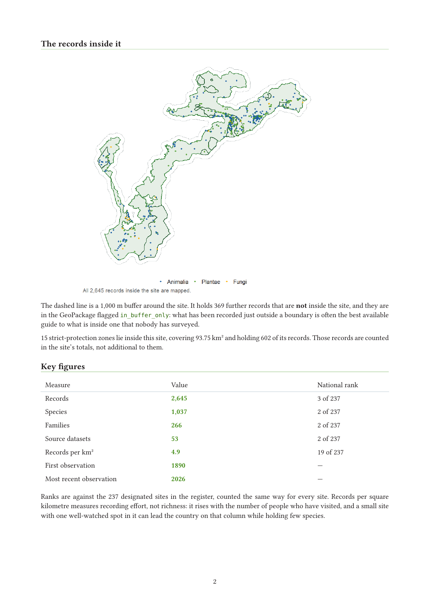
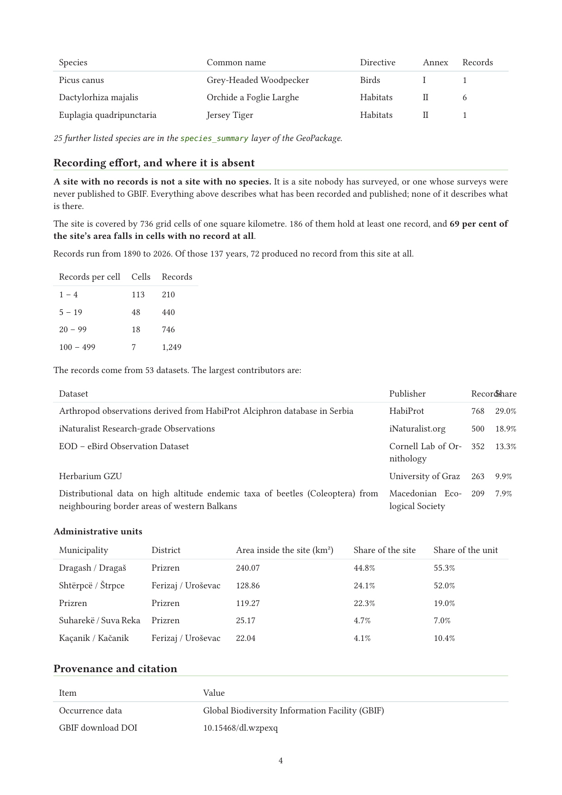
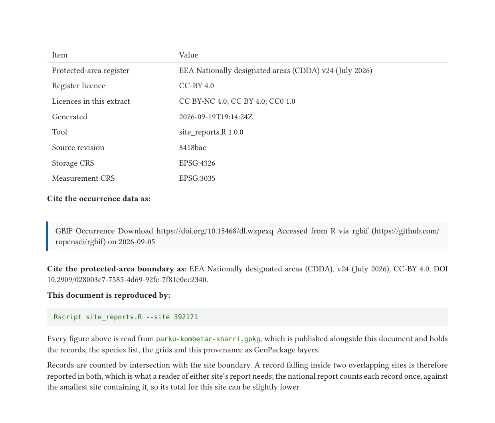

## What this session covers

- **The job** — one protected area, one officer, one question, and the fact
  that it will be asked again.
- **The two inputs** — occurrence records and thematic layers, and the single
  step where they meet.
- **The two outputs** — a GeoPackage that opens in QGIS and a PDF that can go
  in a case file, from one command.
- **What makes it replicable** — configuration in one block, provenance in the
  file, and the rules that stop it failing quietly.

::: {.smaller}
Everything shown is running in this repository and produced the figures on
these slides:
**github.com/jonasgaigr/kosovo-biodiversity-data-workshop-2026**
:::

## The job, and why it repeats {.aopk-section}

Nothing here is a map. It is the machinery that draws the map again next year.

## One register, 237 sites, one question

::: {.aopk-cols}
::: {}
- Kosovo's nationally designated areas, as the EEA holds them: **237 sites**,
  48 with a mapped boundary, 189 recorded as a single point, plus **19
  strict-protection zones**.
- Together **1,261 km²**, or **11.6 %** of the country.
- The national report answers national questions. A conservation officer asked
  about **one site** needs the same evidence for that site alone.
:::

::: {}
Done by hand, that is: open the register, select the site, clip the records,
count the species, draw two maps, look up the Red List and the annexes, write
the provenance, export.

**Twenty minutes, and it is stale the moment GBIF publishes.**

::: {.smaller}
Do it 237 times and the last site is built from a different data snapshot than
the first — which is not a reporting method, it is an inconsistency waiting to
be found by someone else.
:::
:::
:::

## The two inputs

::: {.smaller}
| | **Occurrence data** | **Thematic data** |
|---|---|---|
| What it is | Who saw what, where, when | What the ground is, and what the law says about it |
| Here | 46,831 quality-checked GBIF records, 4,095 species | Designated areas, municipalities, national boundary, annex lists, Red List categories |
| Source | GBIF download service, one DOI | EEA NatDA v24, OpenStreetMap, EUR-Lex, GBIF species API |
| Changes | Continuously — new records every week | Rarely — a register version, a legal amendment |
| Geometry | Points, with a stated uncertainty | Polygons, and the occasional point |
:::

- They are acquired by different routes, on different clocks, and they are
  **never edited into each other by hand**.
- Automation is what keeps a fast-moving layer and a slow-moving one in step
  without anyone remembering to do it.

## Where they meet: the stamp

The pipeline's one join. Every cleaned record is asked which thematic polygons
contain it, and the answer is written onto the record as ordinary columns:

::: {.smaller}
| Column | From | Rule worth knowing |
|---|---|---|
| `municipality`, `district` | OpenStreetMap | 38 municipalities, 7 districts |
| `protectedArea` | EEA register | Where sites overlap, **the smallest** one is taken — the most specific statement anyone has made about that ground |
| `protectedAreaDesignation` | EEA register | In English, from the register's own vocabulary |
| `strictlyProtected` | EEA register | Strict zones are excluded from the site test: each lies inside a site already counted |
| `directive`, `annex` | EUR-Lex annex lists | Matched against the GBIF backbone, not by string |
| `iucnRedListCategory` | GBIF species API | The Red List — **not** the IUCN management category of the site |
:::

After this step the spatial question is already answered in the attribute
table, and every later count is a `filter()`, not a spatial operation.

## The national pass

```bash
Rscript pipeline.R
```

::: {.aopk-cols}
::: {}
Download → clean → match → stamp → export, in one command. It is
**idempotent**: the download key is kept, so re-running does not mint a new DOI
and does not re-fetch what is cached.

::: {.smaller}
The first run takes about twenty minutes, most of it resolving common names one
taxon at a time. Every later run reuses the download and three caches.
:::
:::

::: {}
What it leaves on disk, and what everything downstream reads:

- **six thematic subsets** — overall, birds, Birds Annex I, Habitats
  Directive, Habitats Annex II, IUCN threatened — each as `.gpkg`, `.csv` and,
  where small enough, `.xlsx`;
- the **protected-area register**, in the same three formats;
- `run_metadata.rds` — the **DOI**, the citation and the cleaning report.
:::
:::

## From national data to one site {.aopk-section}

The same evidence, cut to a boundary, in two files a person can actually use.

## One command, two files

```bash
Rscript site_reports.R --site NP_001
```

::: {.aopk-cols}
::: {}
```
[1/2] Parku Kombëtar "Sharri" (392171)
  2,645 records, 1,037 species,
  parku-kombetar-sharri.gpkg written.
  parku-kombetar-sharri.pdf rendered.
  done in 21.7 s
```
:::

::: {}
- `<slug>.gpkg` — nine layers, the whole evidence base for that site.
- `<slug>.pdf` — a four- to six-page report on **exactly those layers**.
- **No credentials and no network.** It reads what the national pass already
  published, and never triggers a download.
:::
:::

::: {.smaller}
`--all` for the whole register, `--designation "National Park"` or
`--min-area-km2 N` to narrow it, `--gpkg-only` / `--pdf-only` for one of the
two, `--force` to rebuild regardless.
:::

## The GeoPackage: nine layers

::: {.smaller}
| Layer | Geometry | What it holds | Sharri |
|---|---|---|---|
| `site_boundary` | polygon | the site, and 16 figures computed from it | 1 |
| `site_buffer` | polygon | the 1 km comparison ring | 1 |
| `strict_protection` | polygon | strictly protected cores inside the site | 15 |
| `occurrences` | point | every record in site **and** buffer, 44 fields | 3,014 |
| `species_richness_grid` | polygon | 1 km cells, species per cell | 186 |
| `record_density_grid` | polygon | 1 km cells, classed record count | 186 |
| `municipalities_overlapping` | polygon | which units, and what share of each | 5 |
| `species_summary` | — | every species, with Red List and annex | 1,037 |
| `report_metadata` | — | provenance, as name-value pairs | 43 |
:::

Stored in **EPSG:4326**, measured in **EPSG:3035** — both recorded in
`report_metadata`, so neither has to be inferred from the numbers. It opens in
QGIS with no conversion and no import step.

## The PDF is a reader of the GeoPackage {.no-leaf}

::: {.aopk-cols}
::: {}

:::

::: {}
- Every figure in the report is **read out of the file beside it**. The report
  recomputes nothing, so the two cannot state different numbers.
- Ranks are against all 237 sites, counted the same way for every site.
- The dashed ring is the 1 km buffer: 369 further records, flagged
  `in_buffer_only`. **What is recorded just outside a boundary is the best
  guide to what is inside one nobody has surveyed.**

::: {.smaller}
Rendered through Quarto's `format: typst`. Typst ships **inside Quarto** — no
TeX distribution, no `tinytex`, nothing to install.
:::
:::
:::

## It reports the gap, not only the data {.no-leaf}

::: {.aopk-cols}
::: {}

:::

::: {}
- **736 cells of one square kilometre; 186 hold a record.** 69 % of the site's
  area falls in cells with no record at all.
- Records run 1890–2026; **72 of those 137 years produced nothing** from this
  site.
- The contributing datasets are named, with their publishers and shares — the
  report says whose data it is standing on.
- Administrative units are listed with the share of the site *and* the share
  of the unit, which are different questions.
:::
:::

## Provenance travels with the file {.no-leaf}

::: {.aopk-cols}
::: {}

:::

::: {}
`report_metadata` carries 43 items, and the PDF prints the ones a reader needs:

- the **GBIF DOI** and the citation text;
- the **register version**, its licence and DOI;
- the licences present in this extract;
- the **tool version and git commit** that produced it;
- both CRSs, the buffer and the grid size;
- every input file and its modification time;
- **the command that reproduces the document.**
:::
:::

## What makes it replicable {.aopk-section}

Not the code. The rules the code keeps.

## Everything country-specific in one block

::: {.smaller}
```r
config <- list(
  path_register     = "data/kosovo_protected_areas.gpkg",
  register_fields   = list(site_name = "site_name", designation = "designation", ...),
  path_occurrences  = "data_exports/kosovo_overall_biodiversity.gpkg",
  path_boundary     = "data/kosovo_boundary.gpkg",
  path_directive_subsets = c("data_exports/kosovo_birds_annex_I.csv", ...),
  crs_metric        = 3035,
  buffer_m          = 1000,
  grid_m            = 1000,
  map_max_points    = 20000
)
```
:::

- `register_fields` maps **your** register's column names onto the published
  schema, so a register that is not a CDDA extract is a list to edit, not code
  to change.
- Set `path_directive_subsets` to nothing where the Nature Directives do not
  apply: the report then **says so**, instead of showing an empty annex table
  as though it were a finding.

## Re-running is cheap, and says so

::: {.aopk-cols}
::: {}
An output is rebuilt when any input is newer than it — and **the code counts as
an input**. A changed template with unchanged data regenerates, or the tool
would quietly republish last month's layout.

Every run appends to `outputs/run_manifest.csv`: one row per site per run, with
the counts, the file sizes, the seconds and the status. **The log is a table,
not prose** — so a run can be audited with a query rather than by reading it.
:::

::: {}
| | |
|---|---|
| Sites | **237** |
| First pass | **47.5 min** |
| Second pass, nothing changed | **3 s** |
| Median per site | 11.7 s |
| GeoPackages · PDFs | 92.6 MB · 23.7 MB |

::: {.smaller}
On a laptop, with the network unplugged. **116 MB** is the entire site-level
evidence base for the network — no server, no licence, no procurement.
:::
:::
:::

## Maps built to render in ten years

- Drawn with `ggplot2`, and with **no tile service of any kind**. A report that
  fetched a basemap while rendering would look different next year and would
  not render at all on a machine with no network.
- The map colours are the **same palette as the website's interactive maps**,
  so a site drawn here and the same site drawn there are the same green.
- The printed report's colours live in one small Typst file, and the test
  harness fails if they drift out of step with the website's stylesheet.

::: {.smaller}
Nothing in the figures is fetched, sampled or randomised. The step that builds
a site's layers is **pure** — same inputs, same tables — which is what lets a
reviewer check a figure by re-running rather than by trusting it.
:::

## Rules against the quiet failure

- **Above 20,000 records the point layer is withheld** and the density grid is
  drawn instead, with the reason printed on the map. Records are never silently
  thinned.
- **Empty layers are written, not omitted.** A missing layer and an empty layer
  look the same to a reader in a hurry, and only one of them is honest.
- **An unknown argument stops the run.** A typo that is merely warned about
  produces a run that looks successful and reports on the wrong sites.
- **One site failing is not the run failing.** The error is logged, the loop
  continues, the summary lists every failure and the exit status is non-zero.
- **One area column, not two.** The register's own figure is dropped in favour
  of one computed in EPSG:3035; two areas differing in the third decimal place
  are worse than one.

## The finding the machine keeps producing

::: {.aopk-cols}
::: {}
- Of 237 designated sites, **22 hold any record at all**. 215 hold none.
- The 22 hold **21,527 records** between them.
- One wetland of **1.1 km²** holds **13,346** of those — 62 % of everything
  recorded inside a protected area in Kosovo.
:::

::: {}
**A site with no records is not a site with no species.** It is a site nobody
has surveyed, or one whose surveys were never published.

Every report says that in as many words, because a reader who takes an empty
table for an assessment will reach exactly the wrong conclusion.

::: {.smaller}
Read the other way, those 215 sites are a **survey priority list**, produced at
no cost as a by-product of the reporting.
:::
:::
:::

## A pilot, end to end {.no-leaf}

::: {.aopk-cols}
::: {.smaller}
1. **QA** — every record placed in its evidence tier.
2. **Gap report** — this tool, on the site and a ring around it.
3. **Field verification** — habitat mapping; standardised bird counts.
4. **Delineation** — along habitats, catchments and visible features, never
   along grid lines.
5. **Assessment** — Annex III, or the SPA criteria species by species.
6. **Network review** — the site's share of each feature, as a range.
7. **Draft SDF** — and a lessons log, which is the real product.
:::

::: {.smaller}
| | Sharri NP | Ligatina e Hencit |
|---|---|---|
| Route | habitats, SCI/SAC | birds, SPA |
| Area | 535.5 km² | 1.1 km² |
| Records | 2,645 | 13,346 |
| Annex I bird species | 18 | 43 |
| 1 km cells with no record | 69 % | 0 % |
| IBA | Sara mountain | none |

```bash
Rscript site_reports.R --site NP_001 --site SAC_001
```

Point `path_register` at a file of candidate polygons, and the same report
shows what a draft boundary leaves out.
:::
:::

## The same machinery, pointed at the SDF

A draft Standard Data Form can be a third output, built from the same layers.

::: {.smaller}
| SDF section | Source in this system | Filled by |
|---|---|---|
| 1 · Identification | the register, via `register_fields` | tool, once a site-code rule is agreed |
| 2 · Location: centre, area, regions | `site_boundary` in EPSG:3035; region overlays | tool |
| 3.1 · Annex I habitats | a habitat map — none exists yet | expert; left blank |
| 3.2 · Directive species | the directive subsets: a **candidate list** | tool lists; population and A–D assessment: expert |
| 3.3 · Other important species | `species_summary`: Red List, Annexes IV, V | tool proposes, expert confirms |
| 4, 6 · Quality, threats, management | field survey and the site's managers | expert; left blank |
| 4.5, 7 · Documentation, map | `report_metadata`; `site_boundary` | tool |
| 5 · Protection status, other sites | overlays with the register and the IBAs | tool |

- **A field it cannot compute is written empty and flagged**, like an empty
  layer. An SDF value is never guessed.
- **No GBIF record reaches the SDF tier on its own:** it can list a species,
  but the population stays `DD` until a survey fills it.
:::

## The SDF speaks its own codes: crosswalks

Between the tool's vocabulary and the SDF's sits a **crosswalk** — a table, not
code, and the part that costs expert time.

::: {.smaller}
| Crosswalk | From → to | Why it is not a lookup |
|---|---|---|
| Taxa | GBIF backbone → Natura 2000 species codes | Splits, lumps, synonyms; endemics folded away |
| Habitats | national or EUNIS types → Annex I codes | Many-to-many: same, narrower, broader, overlapping |
| Designations | national categories → CDDA codes; IDs → site codes | One category can match several codes |
| Data quality | survey method and coverage → `G` `M` `P` `VP` `DD` | A proposal for national agreement |
| Bird status | season, behaviour, breeding → `p` `r` `c` `w`, unit | A rule over several fields, per species |
| Pressures | field notes → Article 17 pressures and threats | Observed in the field, not in the records |

- **Each crosswalk is a versioned table** — source, author and date on every
  row; one more path in the config block, reviewed like data.
- **An unmatched value stops the draft.** A species dropped because its name had
  no code is the quiet failure again.
- Built once, they serve every site, every update, and the Article 12 and 17
  reports, which use the same codes.
:::

## Takeaways

- **Separate the fast layer from the slow one**, and join them in code. Hand
  editing is where the inconsistency enters.
- **Publish the data file, not only the document.** The GeoPackage is what
  someone can work with; the PDF is what they can file.
- **Let the report read the data file**, so the two can never disagree.
- **Put provenance in the output**, not in an email: the DOI, the register
  version, the commit, and the command that rebuilds it.
- **Configuration in one block** is what makes this a tool for a register
  rather than a script for one country.
- **Automate the whole path** — the point is not this year's 237 reports, it is
  that next year's cost one command.

## {.aopk-closing}

::: {.aopk-mission}

**THANK YOU FOR YOUR ATTENTION!**

jonasgaigr.github.io/kosovo-biodiversity-data-workshop-2026

:::

::: {.aopk-lockup}

:::

::: {.aopk-web}
aopk.gov.cz
:::
