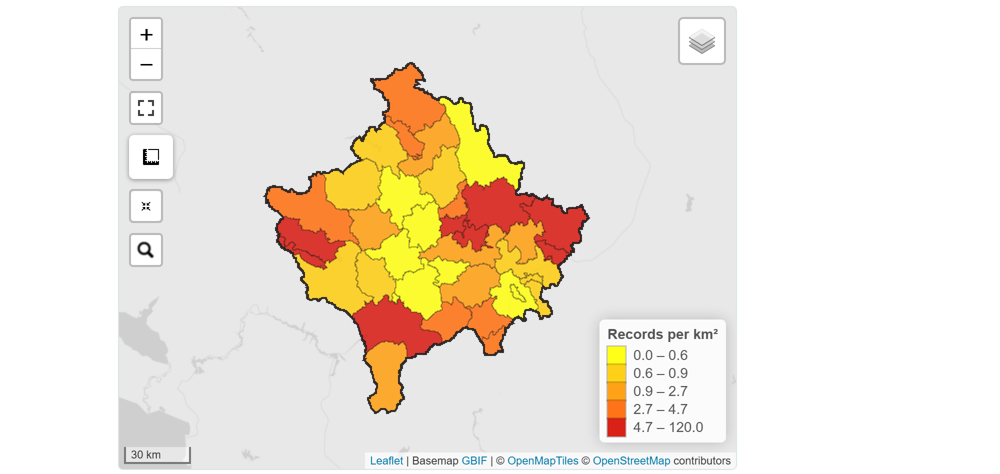
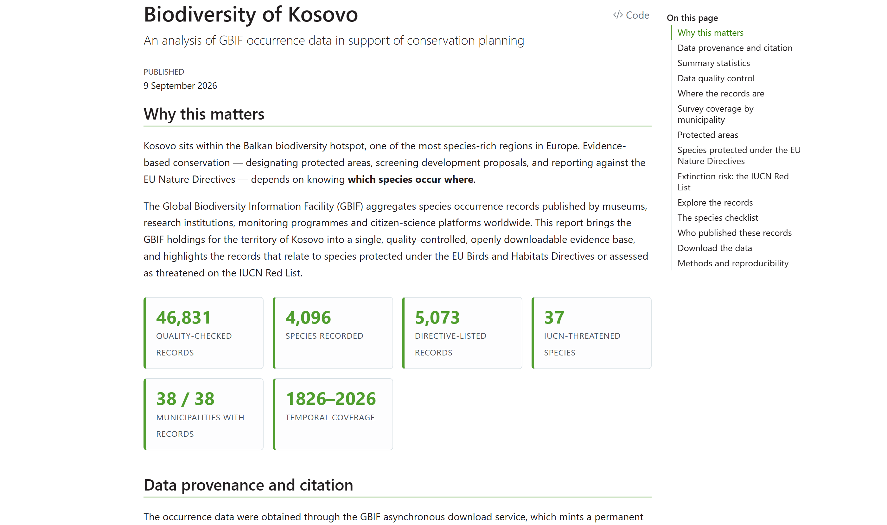
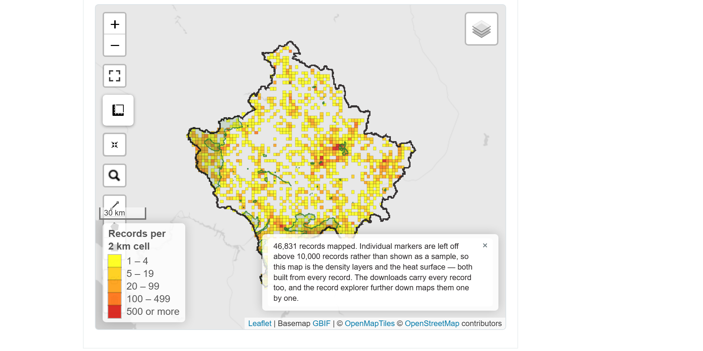
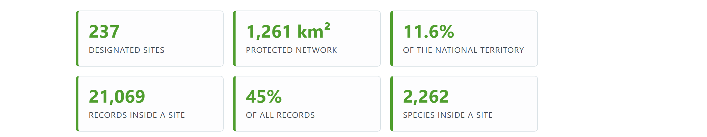
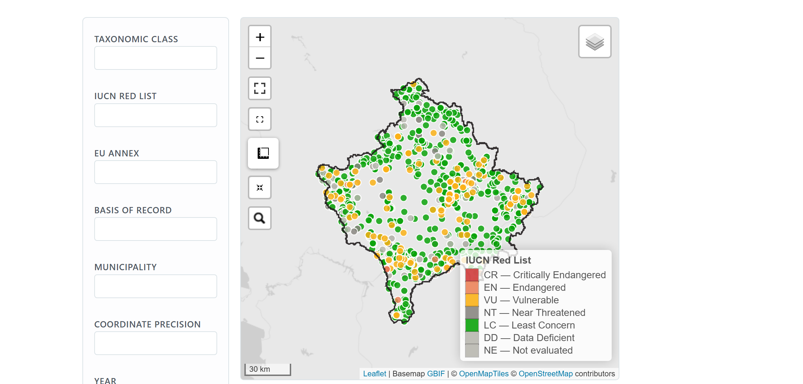
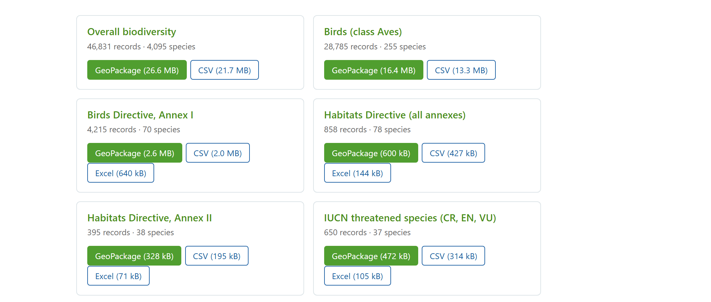

## What this session covers

- **Where the data are** — what GBIF holds for Kosovo, and who put it there.
- **How to get it out** — four routes, and which one to use for which job.
- **How to read it** — what 46,831 records can and cannot tell you.
- **A worked example** — a reproducible site built on exactly this data, for
  exactly this territory.
- **The traps** — five mistakes that produce a plausible answer and no error
  message.

::: {.smaller}
The worked example is live at
**jonasgaigr.github.io/kosovo-biodiversity-data-workshop-2026**, and the code
that builds it is open.
:::

## Getting the data out {.aopk-section}

One aggregator, four doors, and only one of them gives you a citation.

## What GBIF is

::: {.aopk-cols}
::: {}
- An **aggregator**, not a survey. Museums, herbaria, monitoring schemes and
  citizen-science platforms publish; GBIF indexes and serves.
- Every record keeps its **publisher, licence and identifier**. GBIF adds a
  taxonomic backbone and a quality-flag layer on top.
- For the territory of Kosovo: **46,831 quality-checked records**, **4,095
  species**, from **125 datasets** and **80 publishers**.
:::

::: {}
- **eBird alone is 26,009 records** — 56 % of everything, and 219 species.
- 90.7 % of all records are human observations; 1,748 are preserved specimens.
- Kingdoms: 42,003 animals, 3,740 plants, 1,006 fungi.

::: {.smaller}
The national evidence base is, in the main, other people's birdwatching. That
is not a criticism of the data — it is the single most important thing to know
before interpreting it.
:::
:::
:::

## Four ways in

| Route | Best for | Account | Ceiling |
|---|---|---|---|
| **Portal** — gbif.org | Exploring, checking a record, one-off extracts | for downloads | none |
| **REST API** — api.gbif.org | Live queries, maps, name matching, services | no | 100,000 per search |
| **Download service** | The full extract, reporting, **citation** | yes | none |
| **R / Python clients** | Scripted, repeatable pipelines | for downloads | as above |

::: {.smaller}
The four are the same index seen through different doors. The difference that
matters for an institution is that only the download service mints a **DOI**.
:::

## The portal: gbif.org

::: {.aopk-cols}
::: {}
- Faceted search over **occurrences, species, datasets and publishers** —
  filter by country, taxon, year, basis of record, licence.
- The **occurrence map** is the same tile service the API serves, so what you
  see is what you can script.
- **Download** offers Simple CSV, a full Darwin Core Archive, a species list
  and Parquet.
- Every dataset page carries its **licence, publisher and DOI**.
:::

::: {}
**Start here, always.** Before writing a line of code, look at the map and the
dataset list for your area. Ten minutes on the portal tells you whether the
data will answer your question at all — and that is cheaper to learn now than
after a pipeline has been built.

::: {.smaller}
A registered account is free and is needed only to *download*. Searching,
mapping and browsing need nothing.
:::
:::
:::

## The API: no key, no account

::: {.smaller}
| Endpoint | What it gives you |
|---|---|
| `/v1/occurrence/search` | Paged records, every portal filter available as a parameter |
| `/v1/species/match` | A name resolved against the GBIF backbone — the one call to know |
| `/v2/map/occurrence/…` | Ready-made density tiles for a web map |
| `/v1/dataset`, `/v1/organization` | The registry: who published what, under which licence |
| `/v1/occurrence/download/request` | Asynchronous extracts, including **SQL** downloads |
:::

- Read access needs **no key and no registration** — it can sit behind a
  national portal without a credential to manage.
- `/occurrence/search` paging stops at **100,000 records**. Past that, the
  download service is not an optimisation, it is the only option.

## The download service, and why the DOI matters

::: {.aopk-cols}
::: {}
- You post a **predicate** — taxon, area, year, quality flags — GBIF builds the
  extract server-side and emails a link.
- The result carries a **permanent DOI**. Citing it credits every contributing
  institution and lets any reader retrieve the *identical* dataset.
- No size ceiling. In R: `occ_download()` and `occ_download_get()`.
:::

::: {}
**This is the route for anything official.** A report whose evidence base
cannot be re-fetched is not reproducible, and an assessment that cannot be
re-run cannot be defended.

::: {.smaller}
The Kosovo extract used here is
**doi.org/10.15468/dl.wzpexq** — 48,607 raw records, built once and reused by
every subsequent run.
:::
:::
:::

## Which route for which job

::: {.smaller}
| The question | The route |
|---|---|
| Has anyone recorded *Lynx lynx* near this site? | Portal, or `/occurrence/search` |
| Draw a live density map in our own web portal | `/v2/map` tiles |
| Is this name current, and what is its key? | `/species/match` |
| Give me every record in the country, citably | Download service + DOI |
| Rebuild the same analysis next year | `rgbif` / `pygbif` in a script |
| Who published the records we rely on? | `/dataset`, `/organization` |
:::

::: {.smaller}
**One rule of thumb.** If the answer will end up in a document that someone
else has to trust, take the route that gives you a DOI.
:::

## Reading the records honestly {.aopk-section}

Occurrence data answer a narrower question than they appear to.

## Presence, not absence

- A record is a statement that **someone found this taxon here, then, and
  published it**. Nothing more.
- An empty map cell means one of three things, and the data cannot tell you
  which: nobody looked; someone looked and found nothing; someone found
  something and never published it.
- **Absence of records is not evidence of absence.** For screening a
  development proposal, that distinction is the whole ball game.
- Records also cannot carry abundance unless the publisher recorded it — and
  most did not.

## Effort, not richness

::: {.aopk-cols}
::: {}
- **Graçanicë / Gračanica:** 14,672 records, 120 per km² — the densest
  municipality in the country.
- **Mamushë / Mamuša:** 1 record.
- 13,346 of Graçanicë's records come from **one wetland of 1.10 km²**.
- 81 % of dated records are from 2015 or later; trend analysis before then
  rests on thin ground.

**Dense cells mark well-visited places, not rich ones.** Read the density map
as a map of where people go.
:::

::: {}

:::
:::

## How precisely are the records placed?

| Stated coordinate uncertainty | Records | Per cent | Good enough for |
|---|---:|---:|---|
| 100 m or better | 3,180 | 6.8 | a site boundary, once verified |
| 100 m – 1 km | 2,193 | 4.7 | screening at 1–5 km |
| 1 – 10 km | 9,364 | 20.0 | screening at 10 km |
| coarser than 10 km | 90 | 0.2 | presence in the country |
| **not stated** | **32,004** | **68.3** | screening, after a check |

- Two thirds of records **say nothing about their own accuracy**. That is not
  the same as being accurate.
- By precision alone, **one record in fifteen** could help draw a Natura 2000
  boundary — and **one Annex I bird record in twenty**. GBIF is a screening
  layer, and a good one.

## Fitness for use: screen, don't just select

- The download was selected on the **GADM** boundary for Kosovo, because that
  is the filter GBIF offers. GADM's outline is a generalisation.
- Screened against the **OpenStreetMap** border — 60 m median from Eurostat's
  independent digitisation, against GADM's 587 m — **1,776 records (3.7 %)**
  fall outside the country.
- They are not borderline: **94 % carry a publisher-assigned country code of
  `ME`, `MK`, `RS` or `AL`**, a median 552 m beyond the border.
- The opposite error cannot be repaired: **412 km² of Kosovo lies outside
  GADM's polygon**, so records there were never in the download.

::: {.smaller}
Select with the tool's filter. Screen with the best boundary you have. They are
not the same polygon, and using one for both hides both kinds of error.
:::

## The site {.aopk-section}

A reproducible evidence base for one territory, built from the routes above.

## What it is

::: {.aopk-cols}
::: {}
- A **static website**: summary statistics, six interactive maps, a
  browser-side record explorer and open data downloads.
- **One R pipeline** — acquire, screen, annotate, export, credit — and **one
  Quarto document**. Re-running does not mint a new DOI.
- **No server, no database, no hosting cost** — and nothing to keep patched.
- Audience: ministry and agency staff who need the evidence, not the code.
:::

::: {}

:::
:::

## Six thematic extracts

| Extract | Records | Species |
|---|---:|---:|
| Overall biodiversity | 46,831 | 4,095 |
| Birds (class Aves) | 28,785 | 255 |
| Birds Directive, Annex I | 4,215 | 70 |
| Habitats Directive (all annexes) | 858 | 78 |
| Habitats Directive, Annex II | 395 | 38 |
| IUCN threatened (CR, EN, VU) | 650 | 37 |

::: {.smaller}
Each is published as **GeoPackage, CSV and Excel**, and each carries the
municipality, protected area, Red List category and annex membership as
columns — so the subset can be used without re-running any of the matching.
:::

## Maps that answer different questions

::: {.aopk-cols}
::: {}
Five switchable layers on every map:

- **Occurrence records** — pop-up with determination, place, stated accuracy and
  a link through to GBIF
- **Record density** — 2 km grid, classed
- **Heat surface** — the shape of sampled and unsampled ground
- **Protected areas** — a wash under the records
- **Municipalities** — with counts on hover

::: {.smaller}
Basemaps, colours and the density ramp are GBIF's own, taken from its published
brand steps and its live tile service.
:::
:::

::: {}

:::
:::

## Protected areas: where the evidence is {.no-leaf}

- The register is the **European Environment Agency's inventory of nationally
  designated areas** — Kosovo's own official return.
- **20 of the 48 mapped sites carry any occurrence record at all.**
- 63 % of everything inside the network comes from one 1.10 km² wetland. Set it
  aside and the concentration is real but modest.

## Species of Community interest

- The annex lists are **generated from the consolidated EUR-Lex texts**, not
  hand-maintained: Birds I (193 taxa), Birds II (83), Habitats II (887),
  IV (370), V (76).
- Every name resolved against the GBIF backbone, with the asterisked priority
  species and the listing rank preserved.

::: {.smaller}
**Why not the ready-made checklists on GBIF?** They are geographically
filtered. The Birds Annex I checklist holds 128 of the 193 listed taxa — and
the omissions are exactly the ones that matter here. *Alectoris graeca* is
absent, as are the Balkan endemics. Using it would have quietly under-reported
the most conservation-relevant taxa in the country.
:::

## Birds: from records to an SPA case {.no-leaf}

::: {.aopk-cols}
::: {.smaller}
**What the records give**

- **4,215** Annex I bird records of **70** species — **82 %** from eBird,
  which states **no uncertainty** at all.
- The richest site, **Ligatina e Hencit**, holds **43** of the 70 species, and
  is **not an IBA**.
- Kosovo's IBAs — Sara mountain and Prokletije, with Mokra Gora and Kopaonik on
  the boundary — are **mountain sites**, estimated in breeding pairs, several
  from 2008–2013.
:::

::: {.smaller}
**What an SPA case needs**

- **One bird table**, the layers as views of it: Annex I, regular migrant, SDF
  population type (`p` `r` `c` `w`), breeding code, a count **with its unit**.
- For each trigger species, a **population estimate from standardised counts**
  over two or three seasons, and the **criterion** it meets.
- A boundary around **what the birds use** — not the IBA outline.
- **eBird's own dataset** for effort and non-detections; the GBIF copy is
  presence-only.
:::
:::

## The record explorer

::: {.aopk-cols}
::: {}
- Filter by **class, Red List category, EU annex, basis of record,
  municipality, coordinate precision and year**.
- Map and table are **linked** — filter one, the other follows.
- All of it runs in the reader's browser. **No Shiny server, nothing to host.**

::: {.smaller}
The idea is borrowed from the GBIF Viewer built for Ukraine by the Habitat
Foundation and the Ukrainian Nature Conservation Group — a Shiny application —
and re-implemented client-side so it costs nothing to keep running.
:::
:::

::: {}

:::
:::

## Open data, in formats people actually use {.no-leaf}

{width=74%}

::: {.smaller}
GeoPackage for GIS, CSV for anything, Excel where the subset is small enough to
open. Every record keeps its `license` column, and the report credits all 125
datasets and 80 publishers by name.
:::

## Traps that fail silently {.aopk-section}

Every one of these returns a plausible answer and no error message.

## Three about Kosovo specifically

::: {.smaller}
**1. The GADM code is `XKO`, not `XKX`.**
`XKX` is the World Bank / ISO alpha-3 style code. `pred("gadm", "XKX")` returns
**zero records — no error, just an empty dataset**. Measured: `gadmGid=XKO`
returned 52,290 records, `country=XK` 48,947, `gadmGid=XKX` nothing.

**2. `CoordinateCleaner` cannot see Kosovo by default.**
Natural Earth records Kosovo with `iso_a3 == "-99"` — no assigned code. The
country test therefore flags **100 % of Kosovo records**, and with
`value = "clean"` returns an **empty data frame with no warning**. Supply your
own reference polygon.

**3. GADM's Kosovo municipalities are the pre-2010 set — 30, not 38.**
The single coordinate carrying more records than any other in the country, over
thirteen thousand of them, sits on ground that moved to the new municipality of
Graçanicë in 2010. Reported through GADM, every one of them landed in Fushë
Kosovë — and every coverage map and table said so.
:::

## Two about method and tooling

::: {.smaller}
**4. Never screen against the polygon you selected on.**
Screening the download against GADM level 0 — the polygon the download was
built from — flagged nothing at all. That looked like a clean result and was
really the test grading its own paper: every record is inside that polygon *by
construction*, so asking whether it is can only return yes.

**5. Basemap tiles fail without failing.**
CARTO's Positron tiles still return HTTP 200 and a valid PNG, but now carry
"API KEY REQUIRED" stamped diagonally across every one served to an
unauthenticated client. Nothing appears in the console; the map simply looks
wrong.

GBIF's own tiles need no key — but they are **512 pixels**, so they need
`tileSize = 512` and `zoomOffset = -1`. Leave Leaflet's 256-pixel default and
every tile still lands in the right place, at half its designed size, which
reads as a rendering fault rather than a configuration one.
:::

## What this could mean here {.aopk-section}

Two things to take away, one of them larger than the other.

## The smaller one: reuse the pipeline

- The repository is a **template**. Change the area predicate and the annex
  lists and it runs for any territory.
- Everything it depends on is **free and open**: GBIF, OpenStreetMap, the EEA
  inventory, EUR-Lex, R, Quarto, GitHub Pages. No licence, no server, no
  procurement.
- It produces, from one command: a quality-controlled evidence base, a citable
  DOI, six thematic extracts in three formats, and a public report.
- The **pale areas on the density map are a fieldwork plan** — the cheapest
  survey prioritisation available, and it comes free with the data you already
  have.

## The larger one: publish, don't only consume

- 56 % of Kosovo's national record base is **eBird**. The country's own
  monitoring holdings are largely absent from the global index.
- Publishing through an **IPT** would put national survey and monitoring data
  into the same evidence base — visible to reporting, to research and to
  screening, with the publishing institution credited on every record.
- It is also the cheapest route to **Natura 2000 readiness**: the annex
  screening shown here runs on whatever is published, and today that is mostly
  not yours.
- Consuming GBIF answers *what is already known*. Publishing to it is how
  what you know becomes part of the record.

## Takeaways

- **Take the route that gives you a DOI** for anything that ends up in a
  document someone else must trust.
- **Select with the tool's filter; screen with the best boundary you have.**
  They are not the same polygon.
- **Read density as effort, not richness** — and read a blank cell as a
  question, not an answer.
- **Automate the whole path** from download to published report, so next year's
  version costs one command.
- **Publishing is the part that changes the evidence base.** Everything else
  reads it.

## {.aopk-closing}

::: {.aopk-mission}

**THANK YOU FOR YOUR ATTENTION!**

jonasgaigr.github.io/kosovo-biodiversity-data-workshop-2026

:::

::: {.aopk-lockup}

:::

::: {.aopk-web}
aopk.gov.cz
:::
